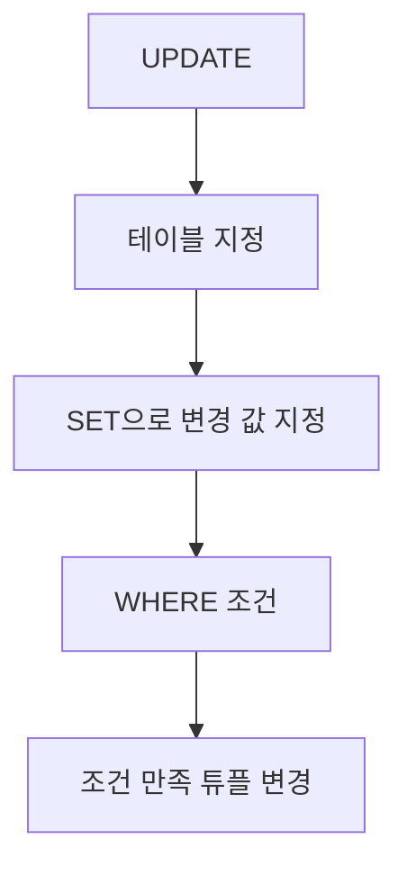

# 151 갱신문(UPDATE~ SET~)

작성 기준일: 2026-06-01
검색/보강일: 2026-06-01
PDF 확인 위치: 22페이지, 3과목 데이터베이스 구축, 151 갱신문(UPDATE~ SET~)

## 한 줄 요약

- UPDATE SET은 기본 테이블의 특정 튜플 내용을 조건에 따라 변경할 때 사용하는 DML 명령이다.



## 한눈에 보는 구조

| 구분 | 내용 |
|---|---|
| 명령 | UPDATE |
| 핵심 절 | SET |
| 분류 | DML |
| 목적 | 기존 튜플 내용 변경 |
| 조건 | WHERE로 변경 대상 제한 |

## PDF 기준 핵심

- 갱신문은 기본 테이블에 있는 튜플들 중에서 특정 튜플의 내용을 변경할 때 사용한다.
- PDF 표기 형식:

```sql
UPDATE 테이블명
SET 속성명 = 데이터[, 속성명 = 데이터, ...]
[WHERE 조건];
```

## 개념 설명

### UPDATE의 의미

- PostgreSQL 공식 문서는 UPDATE가 테이블의 행을 갱신한다고 설명한다.
- SET 절은 어떤 속성을 어떤 값으로 바꿀지 지정한다.
- WHERE 절은 어느 튜플을 바꿀지 지정한다.

### WHERE 조건 주의

- WHERE를 생략하면 여러 튜플이 한꺼번에 변경될 수 있다.
- 시험에서는 구문 구성 요소를 묻지만, 실무에서는 WHERE 누락이 큰 사고로 이어질 수 있다.

## 시험 포인트

- UPDATE는 변경이다.
- SET은 변경할 속성과 값을 지정한다.
- WHERE는 변경 대상 튜플을 제한한다.
- DML에 속한다.
- INSERT는 새 튜플 삽입, UPDATE는 기존 튜플 변경이다.

## 헷갈리는 비교

| 비교 | INSERT | UPDATE |
|---|---|---|
| 역할 | 새 튜플 삽입 | 기존 튜플 변경 |
| 핵심 구문 | VALUES | SET |
| 조건 | 보통 새 값 지정 | WHERE로 대상 제한 |

## 예시 또는 암기 포인트

```sql
UPDATE 학생
SET 학과 = '소프트웨어'
WHERE 학번 = '2026001';
```

- 암기 문장: UPDATE = `SET으로 값 바꾸기`

## 빠른 복습

- UPDATE SET은 갱신문이다.
- 특정 튜플의 내용을 변경한다.
- SET은 변경할 내용을 지정한다.
- WHERE는 변경 대상을 제한한다.
- DML에 속한다.

## 참고 링크

- [PostgreSQL Documentation - UPDATE](https://www.postgresql.org/docs/current/sql-update.html)

