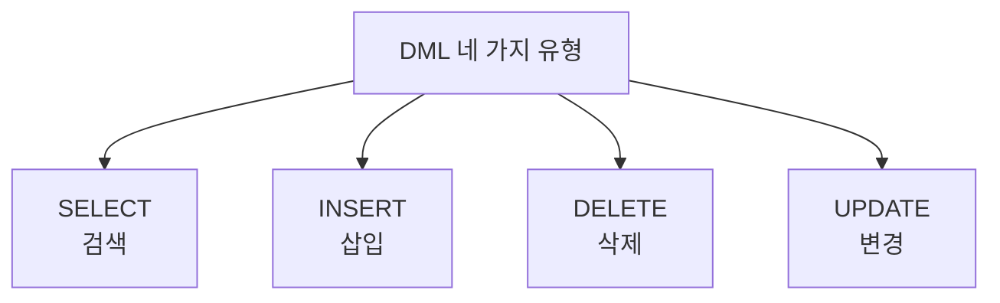

# 152 데이터 조작문의 네 가지 유형

작성 기준일: 2026-06-01
검색/보강일: 2026-06-01
PDF 확인 위치: 22페이지, 3과목 데이터베이스 구축, 152 데이터 조작문의 네 가지 유형

## 한 줄 요약

- 데이터 조작문 DML의 네 가지 기본 유형은 SELECT, INSERT, DELETE, UPDATE이며 각각 검색, 삽입, 삭제, 변경을 담당한다.

## 한눈에 보는 구조

| 유형 | 한글 | 기본 형태 |
|---|---|---|
| SELECT | 검색 | SELECT ~ FROM ~ WHERE |
| INSERT | 삽입 | INSERT INTO ~ VALUES |
| DELETE | 삭제 | DELETE ~ FROM ~ WHERE |
| UPDATE | 변경 | UPDATE ~ SET ~ WHERE |

## PDF 기준 핵심

- `SELECT(검색)`: SELECT ~ FROM ~ WHERE ~
- `INSERT(삽입)`: INSERT INTO ~ VALUES ~
- `DELETE(삭제)`: DELETE ~ FROM ~ WHERE ~
- `UPDATE(변경)`: UPDATE ~ SET ~ WHERE ~

## 개념 설명

### DML 네 가지

- PostgreSQL 공식 문서의 Data Manipulation 장은 행 삽입, 갱신, 삭제, 반환 데이터 등을 다룬다.
- DML은 저장된 데이터를 직접 조작하는 명령 모음이다.
- 구조를 정의하는 DDL, 권한과 트랜잭션을 제어하는 DCL과 구분해야 한다.

### 기본 구문 패턴

- SELECT는 FROM에서 테이블을 정하고 WHERE로 조건을 둔다.
- INSERT는 INSERT INTO로 대상 테이블을 정하고 VALUES로 값을 넣는다.
- DELETE는 FROM에서 대상 테이블을 정하고 WHERE로 삭제 대상을 제한한다.
- UPDATE는 SET으로 변경 내용을 정하고 WHERE로 변경 대상을 제한한다.

## 시험 포인트

- 네 가지 유형과 한글 기능을 1:1로 외운다.
- INSERT에는 VALUES가 붙는다.
- UPDATE에는 SET이 붙는다.
- SELECT, DELETE에는 WHERE 조건이 자주 함께 나온다.
- DELETE와 DROP TABLE을 구분한다.

## 헷갈리는 비교

| 기능 | DML | DDL |
|---|---|---|
| 행 삽입 | INSERT | 해당 없음 |
| 행 삭제 | DELETE | 해당 없음 |
| 테이블 삭제 | 해당 없음 | DROP TABLE |
| 테이블 생성 | 해당 없음 | CREATE TABLE |

## 예시 또는 암기 포인트

- `셀인딜업`으로 외우면 빠르다.
- SELECT = 검색
- INSERT = 삽입
- DELETE = 삭제
- UPDATE = 변경

## 빠른 복습

- 데이터 조작문은 DML이다.
- SELECT는 검색이다.
- INSERT는 삽입이다.
- DELETE는 삭제이다.
- UPDATE는 변경이다.

## 참고 링크

- [PostgreSQL Documentation - Data Manipulation](https://www.postgresql.org/docs/current/dml.html)
- [PostgreSQL Documentation - SELECT](https://www.postgresql.org/docs/current/sql-select.html)

