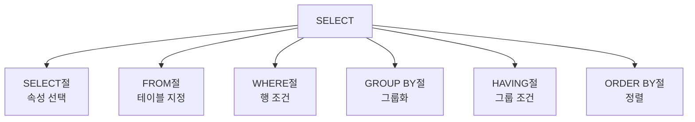

# 153 Select문

작성 기준일: 2026-06-01
검색/보강일: 2026-06-01
PDF 확인 위치: 22페이지, 3과목 데이터베이스 구축, 153 Select문

## 한 줄 요약

- SELECT문은 테이블에서 원하는 속성과 튜플을 검색하며, FROM, WHERE, GROUP BY, HAVING, ORDER BY 절로 검색 대상·조건·그룹·정렬을 제어한다.



## 한눈에 보는 구조

| 절 | 역할 |
|---|---|
| SELECT | 검색할 속성, 수식 지정 |
| FROM | 검색 대상 테이블 지정 |
| WHERE | 튜플 조건 지정 |
| GROUP BY | 특정 속성 기준으로 그룹화 |
| HAVING | 그룹 조건 지정 |
| ORDER BY | 정렬 기준과 정렬 방식 지정 |

## PDF 기준 핵심

- PDF 표기 형식:

```sql
SELECT [PREDICATE] [테이블명.]속성명1, [테이블명.]속성명2, ...
FROM 테이블명1, 테이블명2, ...
[WHERE 조건]
[GROUP BY 속성명1, 속성명2, ...]
[HAVING 조건]
[ORDER BY 속성명 [ASC | DESC]];
```

- SELECT절:
  - Predicate는 불러올 튜플 수를 제한할 명령어이다.
  - DISTINCT는 중복된 튜플이 있으면 그중 한 개만 검색한다.
  - 속성명은 검색하여 불러올 속성 또는 수식이다.
- FROM절은 질의에 의해 검색될 데이터들을 포함하는 테이블명이다.
- WHERE절은 검색할 조건이다.
- GROUP BY절은 특정 속성을 기준으로 그룹화하여 검색할 때 그룹화할 속성이다.
- HAVING절은 그룹에 대한 조건이다.
- ORDER BY절은 정렬 기준 속성과 정렬 방식을 지정한다.

## 개념 설명

### SELECT문의 의미

- PostgreSQL 공식 문서는 SELECT가 0개 이상의 테이블에서 행을 검색한다고 설명한다.
- SELECT문은 단순 조회부터 그룹화, 집계, 정렬까지 포함하는 핵심 SQL 문이다.

### WHERE와 HAVING

- WHERE는 그룹화 전에 개별 튜플을 필터링한다.
- HAVING은 GROUP BY로 만들어진 그룹에 대한 조건이다.
- 시험에서는 WHERE와 HAVING의 대상 차이를 자주 묻는다.

### ORDER BY

- ASC는 오름차순, DESC는 내림차순이다.
- SQL 표준과 PostgreSQL 문서 기준으로 정렬 방향을 생략하면 기본은 ASC로 처리된다.
- 시험에서도 일반적으로 `ASC 또는 생략 = 오름차순`, `DESC = 내림차순`으로 정리한다.

## 시험 포인트

- SELECT절은 검색할 속성을 지정한다.
- FROM절은 테이블을 지정한다.
- WHERE절은 튜플 조건이다.
- GROUP BY절은 그룹화 속성이다.
- HAVING절은 그룹 조건이다.
- ORDER BY절은 정렬 기준이다.
- DISTINCT는 중복 제거 단서이다.

## 헷갈리는 비교

| 비교 | WHERE | HAVING |
|---|---|---|
| 대상 | 개별 튜플 | 그룹 |
| 위치 | GROUP BY 전 논리 처리 | GROUP BY 후 그룹 조건 |
| 예 | 학과 = '컴퓨터공학' | COUNT(*) >= 10 |

| 비교 | ASC | DESC |
|---|---|---|
| 의미 | 오름차순 | 내림차순 |
| 생략 시 | 보통 ASC | 명시 필요 |

## 예시 또는 암기 포인트

```sql
SELECT 학과, COUNT(*) AS 인원수
FROM 학생
WHERE 재학상태 = '재학'
GROUP BY 학과
HAVING COUNT(*) >= 10
ORDER BY 인원수 DESC;
```

- 암기 흐름: `SELECT-FROM-WHERE-GROUP-HAVING-ORDER`

## 빠른 복습

- SELECT문은 검색문이다.
- DISTINCT는 중복 제거이다.
- FROM은 대상 테이블이다.
- WHERE는 행 조건, HAVING은 그룹 조건이다.
- GROUP BY는 그룹화, ORDER BY는 정렬이다.

## 참고 링크

- [PostgreSQL Documentation - SELECT](https://www.postgresql.org/docs/current/sql-select.html)

<!-- study-links:start -->
## 관련 문서

- `sql`: [[sql-query/sql-query|반드시 알아둬야 할 SQL 쿼리 정리]]
- `튜플`: [[정보처리기사/3과목 데이터베이스 구축/106 튜플(Tuple)/106 튜플(Tuple)|106 튜플(Tuple)]]
<!-- study-links:end -->
