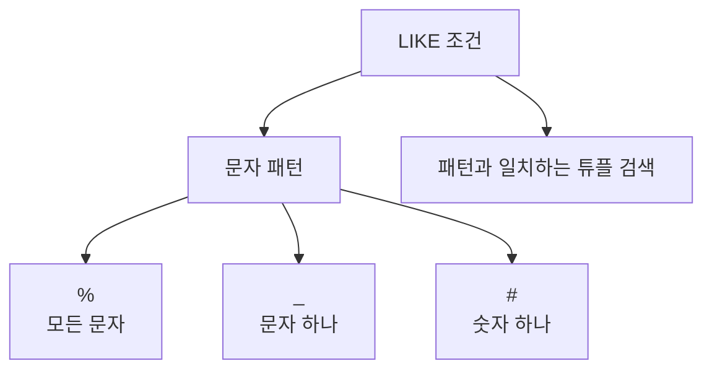

# 154 조건 연산자 - LIKE

작성 기준일: 2026-06-01
검색/보강일: 2026-06-01
PDF 확인 위치: 22페이지, 3과목 데이터베이스 구축, 154 조건 연산자 - LIKE

## 한 줄 요약

- LIKE는 대표 문자를 사용해 지정 속성의 값이 특정 문자 패턴과 일치하는 튜플을 검색하는 조건 연산자이다.



## 한눈에 보는 구조

| 대표 문자 | PDF 기준 의미 | 예 |
|---|---|---|
| `%` | 모든 문자를 대표 | `김%` |
| `_` | 문자 하나를 대표 | `김_보` |
| `#` | 숫자 하나를 대표 | `2026#` |

## PDF 기준 핵심

- LIKE는 대표 문자를 이용해 지정된 속성의 값이 문자 패턴과 일치하는 튜플을 검색하기 위해 사용된다.
- 대표 문자:
  - `%`: 모든 문자를 대표한다.
  - `_`: 문자 하나를 대표한다.
  - `#`: 숫자 하나를 대표한다.

## 개념 설명

### LIKE의 의미

- PostgreSQL 공식 문서는 LIKE 패턴에서 `%`는 0개 이상의 문자 시퀀스와 일치하고 `_`는 문자 하나와 일치한다고 설명한다.
- PDF에는 `#`도 제시되는데, 이는 일부 DBMS나 Access 계열에서 숫자 하나를 나타내는 대표 문자로 쓰인다.
- 시험에서는 PDF의 `%`, `_`, `#` 의미를 그대로 기억한다.

### 패턴 예

- `이름 LIKE '김%'`
  - 김으로 시작하는 이름
- `이름 LIKE '김_보'`
  - 김과 보 사이에 문자 하나가 있는 이름
- `코드 LIKE 'A###'`
  - A 뒤에 숫자 세 개가 오는 코드 형식

## 시험 포인트

- LIKE는 문자 패턴 검색이다.
- `%`는 모든 문자를 대표한다.
- `_`는 문자 하나를 대표한다.
- `#`는 숫자 하나를 대표한다는 PDF 단서를 기억한다.
- BETWEEN은 범위 검색이므로 LIKE와 구분한다.

## 헷갈리는 비교

| 비교 | LIKE | BETWEEN |
|---|---|---|
| 목적 | 문자 패턴 일치 | 범위 포함 |
| 주요 기호 | %, _, # | AND |
| 예 | 이름 LIKE '김%' | 점수 BETWEEN 80 AND 90 |

## 예시 또는 암기 포인트

```sql
SELECT *
FROM 학생
WHERE 이름 LIKE '김%';
```

- 암기 문장: `%는 길이 자유`, `_는 딱 한 글자`, `#은 숫자 한 자리`

## 빠른 복습

- LIKE는 조건 연산자이다.
- 대표 문자로 문자 패턴을 검색한다.
- `%`는 모든 문자이다.
- `_`는 문자 하나이다.
- `#`는 숫자 하나이다.

## 참고 링크

- [PostgreSQL Documentation - Pattern Matching](https://www.postgresql.org/docs/current/functions-matching.html)

<!-- study-links:start -->
## 관련 문서

- `조건 연산자`: [[정보처리기사/3과목 데이터베이스 구축/155 조건 연산자 - BETWEEN/155 조건 연산자 - BETWEEN|155 조건 연산자 - BETWEEN]]
- `튜플`: [[정보처리기사/3과목 데이터베이스 구축/106 튜플(Tuple)/106 튜플(Tuple)|106 튜플(Tuple)]]
<!-- study-links:end -->
