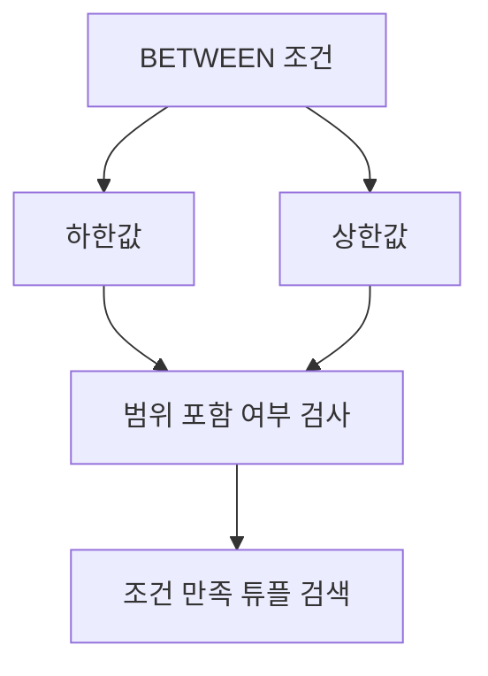

# 155 조건 연산자 - BETWEEN

작성 기준일: 2026-06-01
검색/보강일: 2026-06-01
PDF 확인 위치: 23페이지, 3과목 데이터베이스 구축, 155 조건 연산자 - BETWEEN

## 한 줄 요약

- BETWEEN은 지정 속성 값이 두 값 사이의 범위에 포함되는 튜플을 검색할 때 사용하는 조건 연산자이다.



## 한눈에 보는 구조

| 구분 | 내용 |
|---|---|
| 명령 | BETWEEN |
| 역할 | 두 값 사이 범위 검색 |
| 형태 | 속성 BETWEEN 값1 AND 값2 |
| 포함성 | 일반 SQL에서는 양 끝값 포함 |
| 비교 | LIKE는 패턴 검색 |

## PDF 기준 핵심

- BETWEEN은 지정된 속성이 두 숫자 사이의 값을 가지는 튜플을 검색하기 위해 사용된다.
- PDF 예:

```sql
WHERE 생일 BETWEEN #01/09/69# AND #10/22/73#
```

## 개념 설명

### BETWEEN의 의미

- PostgreSQL 공식 문서는 `a BETWEEN x AND y`가 `a >= x AND a <= y`와 같다고 설명한다.
- 즉 일반적인 SQL에서 BETWEEN은 양 끝값을 포함한다.
- 날짜, 숫자 범위 조건에 자주 사용된다.

### 사용 예

- 점수가 80 이상 90 이하인 튜플 검색
- 생일이 특정 기간 안에 있는 튜플 검색
- 주문일이 한 달 범위에 있는 튜플 검색

## 시험 포인트

- BETWEEN은 범위 검색이다.
- `BETWEEN 값1 AND 값2` 형태를 기억한다.
- LIKE는 문자 패턴 검색이다.
- SQL 기준으로 BETWEEN은 양 끝값을 포함한다.
- PDF 예시는 날짜 범위 검색이다.

## 헷갈리는 비교

| 비교 | BETWEEN | 비교 연산자 조합 |
|---|---|---|
| 표현 | 점수 BETWEEN 80 AND 90 | 점수 >= 80 AND 점수 <= 90 |
| 의미 | 범위 포함 | 같은 의미로 표현 가능 |

## 예시 또는 암기 포인트

```sql
SELECT *
FROM 학생
WHERE 점수 BETWEEN 80 AND 90;
```

- 암기 문장: BETWEEN = `A와 B 사이, 양끝 포함`

## 빠른 복습

- BETWEEN은 조건 연산자이다.
- 두 값 사이 범위를 검색한다.
- 기본 형태는 `속성 BETWEEN 값1 AND 값2`이다.
- LIKE와 달리 패턴이 아니라 범위이다.

## 참고 링크

- [PostgreSQL Documentation - Comparison Functions and Operators](https://www.postgresql.org/docs/current/functions-comparison.html)

<!-- study-links:start -->
## 관련 문서

- `comparison`: [[각종 논리 연산 논법/comparison|비교 로직과 정렬 관련 문법 정리]]
- `조건 연산자`: [[정보처리기사/3과목 데이터베이스 구축/154 조건 연산자 - LIKE/154 조건 연산자 - LIKE|154 조건 연산자 - LIKE]]
- `sql`: [[sql-query/sql-query|반드시 알아둬야 할 SQL 쿼리 정리]]
- `튜플`: [[정보처리기사/3과목 데이터베이스 구축/106 튜플(Tuple)/106 튜플(Tuple)|106 튜플(Tuple)]]
<!-- study-links:end -->
