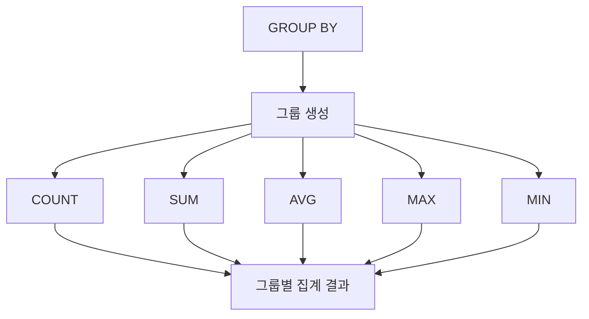

# 156 그룹 함수

작성 기준일: 2026-06-01
검색/보강일: 2026-06-01
PDF 확인 위치: 23페이지, 3과목 데이터베이스 구축, 156 그룹 함수

## 한 줄 요약

- 그룹 함수는 GROUP BY로 나눈 그룹별로 튜플 수, 합계, 평균, 최대값, 최소값 같은 집계 결과를 계산하는 함수이다.



## 한눈에 보는 구조

| 함수 | 의미 |
|---|---|
| COUNT | 그룹별 튜플 수 |
| SUM | 그룹별 합계 |
| AVG | 그룹별 평균 |
| MAX | 그룹별 최대값 |
| MIN | 그룹별 최소값 |

## PDF 기준 핵심

- 그룹 함수는 GROUP BY절에 지정된 그룹별로 속성의 값을 집계할 때 사용된다.
- COUNT/SUM/AVG/MAX/MIN(속성명)은 각각 그룹별 튜플 수, 합계, 평균, 최대값, 최소값을 구하는 함수이다.

## 개념 설명

### 그룹 함수의 의미

- PostgreSQL 공식 문서는 count, sum, avg, max, min 같은 집계 함수를 제공한다.
- 그룹 함수는 여러 튜플을 하나의 요약 값으로 만든다.
- GROUP BY가 있으면 그룹별로 집계하고, 없으면 전체 결과를 하나의 그룹처럼 집계한다.

### GROUP BY와 HAVING

- GROUP BY는 어떤 기준으로 묶을지 정한다.
- 그룹 함수는 묶인 결과마다 계산된다.
- HAVING은 그룹 함수 결과에 조건을 걸 때 사용한다.

## 시험 포인트

- COUNT는 튜플 수이다.
- SUM은 합계이다.
- AVG는 평균이다.
- MAX는 최대값이다.
- MIN은 최소값이다.
- GROUP BY는 그룹화, HAVING은 그룹 조건이다.

## 헷갈리는 비교

| 비교 | WHERE | HAVING |
|---|---|---|
| 시점 | 그룹화 전 튜플 조건 | 그룹화 후 그룹 조건 |
| 그룹 함수 사용 | 일반적으로 부적합 | 자주 사용 |
| 예 | 점수 >= 80 | AVG(점수) >= 80 |

## 예시 또는 암기 포인트

```sql
SELECT 학과, COUNT(*) AS 인원수, AVG(점수) AS 평균점수
FROM 학생
GROUP BY 학과;
```

- 암기 문장: `카썸에맥민`

## 빠른 복습

- 그룹 함수는 그룹별 집계 함수이다.
- COUNT는 개수이다.
- SUM은 합계, AVG는 평균이다.
- MAX는 최대값, MIN은 최소값이다.
- GROUP BY와 HAVING을 함께 이해한다.

## 참고 링크

- [PostgreSQL Documentation - Aggregate Functions](https://www.postgresql.org/docs/current/functions-aggregate.html)
- [PostgreSQL Documentation - GROUP BY and HAVING](https://www.postgresql.org/docs/current/queries-table-expressions.html#QUERIES-GROUP)

<!-- study-links:start -->
## 관련 문서

- `튜플`: [[정보처리기사/3과목 데이터베이스 구축/106 튜플(Tuple)/106 튜플(Tuple)|106 튜플(Tuple)]]
<!-- study-links:end -->
