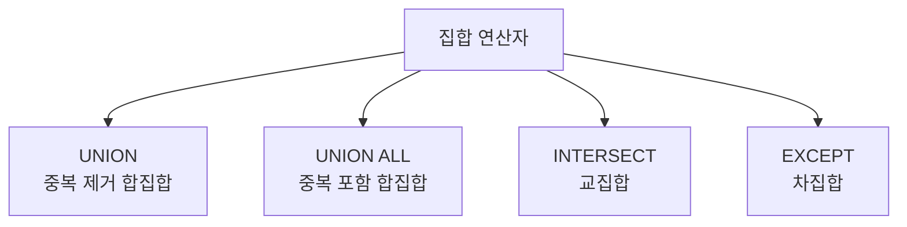

# 157 집합 연산자의 종류

작성 기준일: 2026-06-01
검색/보강일: 2026-06-01
PDF 확인 위치: 23페이지, 3과목 데이터베이스 구축, 157 집합 연산자의 종류

## 한 줄 요약

- SQL 집합 연산자는 두 조회 결과를 합치거나, 공통 부분만 남기거나, 한쪽에서 다른 쪽을 제외하는 연산이며 UNION, UNION ALL, INTERSECT, EXCEPT가 핵심이다.

## 한눈에 보는 구조

| 연산자 | 의미 | 중복 처리 |
|---|---|---|
| UNION | 두 조회 결과를 통합, 중복 행은 한 번만 출력 | 중복 제거 |
| UNION ALL | 두 조회 결과를 통합, 중복 행도 그대로 출력 | 중복 유지 |
| INTERSECT | 두 조회 결과 중 공통 행만 출력 | 공통 부분 |
| EXCEPT | 첫 번째 결과에서 두 번째 결과를 제외 | 차집합 |

## PDF 기준 핵심

- `UNION`: 두 조회 결과를 통합하여 모두 출력하되, 중복된 행은 한 번만 출력한다.
- `UNION ALL`: 두 조회 결과를 통합하여 모두 출력하되, 중복된 행도 그대로 출력한다.
- `INTERSECT`: 두 조회 결과 중 공통된 행만 출력한다.
- `EXCEPT`: 첫 번째 조회 결과에서 두 번째 조회 결과를 제외한 행을 출력한다.

## 개념 설명

### 집합 연산자의 의미

- PostgreSQL 공식 문서는 UNION, INTERSECT, EXCEPT로 둘 이상의 질의 결과를 결합할 수 있다고 설명한다.
- 집합 연산자는 두 SELECT 결과의 컬럼 수와 대응 타입이 맞아야 사용할 수 있다.
- 시험에서는 각 연산자의 의미와 중복 처리 차이가 핵심이다.

### UNION과 UNION ALL

- UNION은 중복을 제거한다.
- UNION ALL은 중복을 제거하지 않는다.
- `ALL`이 붙으면 중복을 그대로 포함한다고 기억하면 쉽다.

## 시험 포인트

- UNION은 중복 제거 합집합이다.
- UNION ALL은 중복 포함 합집합이다.
- INTERSECT는 교집합이다.
- EXCEPT는 차집합이다.
- EXCEPT는 첫 번째 결과에서 두 번째 결과를 빼는 방향성이 있다.

## 헷갈리는 비교

| 비교 | UNION | UNION ALL |
|---|---|---|
| 중복 행 | 한 번만 출력 | 그대로 출력 |
| 성격 | 합집합 | 중복 허용 합침 |

| 비교 | INTERSECT | EXCEPT |
|---|---|---|
| 의미 | 공통 행 | 첫 번째에서 두 번째 제외 |
| 집합 | 교집합 | 차집합 |

## 예시 또는 암기 포인트

- A = {1, 2, 2, 3}, B = {2, 3, 4}
- UNION 결과는 {1, 2, 3, 4}
- UNION ALL은 중복을 포함해 모두 연결한다.
- INTERSECT는 {2, 3}
- EXCEPT는 A에서 B를 제외해 {1} 방향으로 이해한다.

## 빠른 복습

- 집합 연산자는 UNION, UNION ALL, INTERSECT, EXCEPT이다.
- UNION은 중복 제거이다.
- UNION ALL은 중복 포함이다.
- INTERSECT는 공통 행만 출력한다.
- EXCEPT는 첫 번째 결과에서 두 번째 결과를 제외한다.

## 참고 링크

- [PostgreSQL Documentation - Combining Queries](https://www.postgresql.org/docs/current/queries-union.html)

<!-- study-links:start -->
## 관련 문서

- `sql`: [[sql-query/sql-query|반드시 알아둬야 할 SQL 쿼리 정리]]
<!-- study-links:end -->
