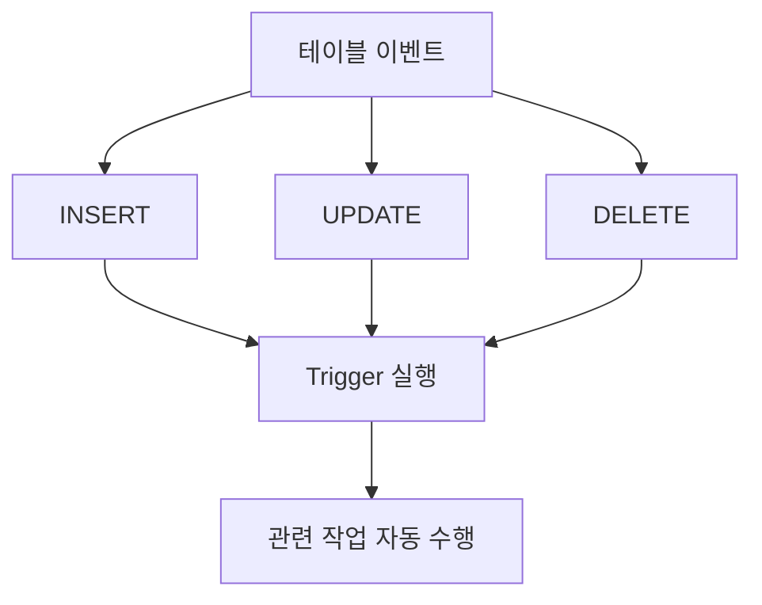

# 158 트리거(Trigger)

작성 기준일: 2026-06-01
검색/보강일: 2026-06-01
PDF 확인 위치: 23페이지, 3과목 데이터베이스 구축, 158 트리거(Trigger)

## 한 줄 요약

- 트리거는 INSERT, UPDATE, DELETE 같은 이벤트가 발생할 때마다 미리 정의한 관련 작업이 자동으로 수행되는 절차형 SQL이다.

## 한눈에 보는 구조

| 구분 | 내용 |
|---|---|
| 정체 | 절차형 SQL |
| 실행 계기 | 삽입, 갱신, 삭제 이벤트 |
| 실행 방식 | 이벤트 발생 시 자동 수행 |
| 활용 | 감사 로그, 검증, 연쇄 처리 |
| 주의 | 숨은 자동 동작으로 복잡도 증가 가능 |

## PDF 기준 핵심

- 트리거는 데이터의 삽입(Insert), 갱신(Update), 삭제(Delete) 등의 이벤트가 발생할 때마다 관련 작업이 자동으로 수행되는 절차형 SQL이다.

## 개념 설명

### 트리거의 의미

- PostgreSQL 공식 문서는 CREATE TRIGGER가 새 트리거를 정의하며, 지정된 이벤트가 지정된 테이블 등에 발생할 때 트리거 함수가 실행된다고 설명한다.
- 트리거는 사용자가 직접 호출하는 일반 함수와 달리 데이터 변경 이벤트에 반응해 자동 실행된다.

### 실행 시점과 이벤트

- 이벤트:
  - INSERT
  - UPDATE
  - DELETE
- 실행 시점:
  - BEFORE
  - AFTER
  - INSTEAD OF
- 시험에서는 PDF 기준으로 이벤트 발생 시 자동 수행이라는 점이 가장 중요하다.

## 시험 포인트

- 트리거는 절차형 SQL이다.
- INSERT, UPDATE, DELETE 이벤트와 연결한다.
- 이벤트 발생 시 관련 작업이 자동 수행된다.
- 수동으로 매번 실행하는 일반 SQL 문과 구분한다.
- 무결성 유지, 로그 기록, 연쇄 처리 예시와 함께 이해한다.

## 헷갈리는 비교

| 비교 | 트리거 | 저장 프로시저 |
|---|---|---|
| 실행 방식 | 이벤트 발생 시 자동 실행 | 명시적으로 호출 |
| 연결 대상 | 테이블 이벤트 | 업무 로직 호출 |
| 시험 단서 | Insert/Update/Delete 이벤트 | Procedure, CALL |

## 예시 또는 암기 포인트

- 주문이 삽입되면 재고 변경 로그를 자동으로 남긴다.
- 학생 정보가 삭제되면 삭제 이력을 자동 기록한다.
- 암기 문장: Trigger = `이벤트가 방아쇠처럼 자동 실행`

## 빠른 복습

- 트리거는 Trigger이다.
- INSERT, UPDATE, DELETE 이벤트와 연결된다.
- 관련 작업이 자동으로 수행된다.
- 절차형 SQL이다.
- 명시 호출보다 이벤트 기반 자동 실행이 핵심이다.

## 참고 링크

- [PostgreSQL Documentation - CREATE TRIGGER](https://www.postgresql.org/docs/current/sql-createtrigger.html)
- [PostgreSQL Documentation - Trigger Definition](https://www.postgresql.org/docs/current/trigger-definition.html)

<!-- study-links:start -->
## 관련 문서

- `sql`: [[sql-query/sql-query|반드시 알아둬야 할 SQL 쿼리 정리]]
- `무결성`: [[정보처리기사/3과목 데이터베이스 구축/115 무결성/115 무결성|115 무결성]]
<!-- study-links:end -->
