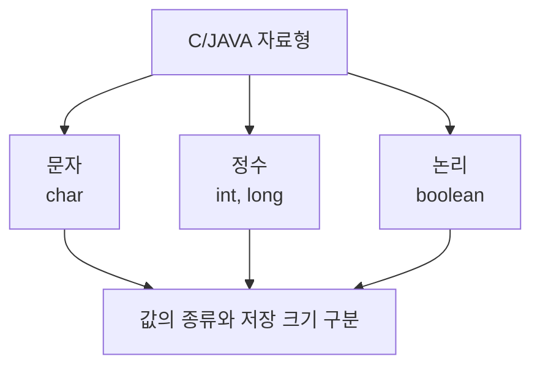

# 159 C/JAVA의 자료형

작성 기준일: 2026-06-01
검색/보강일: 2026-06-01
PDF 확인 위치: 23페이지, 4과목 프로그래밍 언어 활용, 159 C/JAVA의 자료형

## 한 줄 요약

- C와 Java의 기본 자료형은 문자, 정수, 논리 값 등을 저장하기 위한 타입이며, 시험에서는 `char`, `int`, `long`, `boolean`의 언어별 존재 여부와 크기 단서를 구분한다.



## 한눈에 보는 구조

| 종류 | C | Java | 시험 단서 |
|---|---|---|---|
| 문자 | char | char | 문자 저장 |
| 정수 | int, long | int, long | 정수 저장 |
| 논리 | 표준 C에는 별도 `boolean` 키워드가 기본형이 아님 | boolean | 참/거짓 |

## PDF 기준 핵심

- PDF는 C와 Java의 자료형을 표로 비교한다.
- 문자 자료형:
  - C: `char`
  - Java: `char`
- 정수 자료형:
  - C: `int`, `long`
  - Java: `int`, `long`
- 논리 자료형:
  - Java: `boolean`
- PDF 표에는 크기 단서가 함께 제시되며, 시험에서는 PDF의 표기와 보기의 조합을 우선 확인한다.

## 개념 설명

### C 자료형

- C의 기본 자료형은 정수형, 실수형, 문자형 등을 포함한다.
- cppreference는 C 언어의 산술 타입과 구조체, 연산자 등을 체계적으로 정리한다.
- C 표준 자체에는 Java처럼 `boolean`이라는 기본 키워드가 전통적으로 존재하지 않았고, C99 이후 `_Bool`과 `stdbool.h`의 `bool` 매크로를 사용할 수 있다.

### Java 자료형

- Oracle Java Tutorial은 Java가 8개의 primitive data type을 제공한다고 설명한다.
- Java primitive types:
  - byte
  - short
  - int
  - long
  - float
  - double
  - boolean
  - char
- Java Language Specification은 primitive type과 reference type을 구분한다.
- 공식 Java 사양에서 `char`는 16-bit unsigned integer로 정의된다. 시험 PDF 표기와 실제 언어 사양이 다르게 보일 수 있으므로, 문제에서는 제시된 보기와 PDF 표현을 우선 대조한다.

## 시험 포인트

- C와 Java 모두 `char`, `int`, `long`을 사용한다.
- Java에는 `boolean` 기본형이 있다.
- C의 논리형은 Java의 `boolean`과 그대로 같다고 보면 안 된다.
- Java의 primitive type은 8개라는 실무 지식도 함께 기억한다.
- 시험에서 크기 문제가 나오면 PDF 표와 문제 보기의 단위를 우선 확인한다.

## 헷갈리는 비교

| 비교 | C | Java |
|---|---|---|
| 논리형 | `_Bool`, `stdbool.h`의 `bool` 사용 가능 | `boolean` 기본형 |
| char | 구현과 문자 인코딩 문맥에 주의 | Java 사양상 16-bit char |
| long | 환경에 따라 C 크기 차이가 있을 수 있음 | Java는 정해진 primitive type 체계 |

## 예시 또는 암기 포인트

```c
char c = 'A';
int n = 10;
long m = 100000L;
```

```java
char c = 'A';
int n = 10;
long m = 100000L;
boolean ok = true;
```

- 암기 문장: `Java에는 boolean, C는 논리형 표현 방식 주의`

## 빠른 복습

- C/JAVA 자료형 문제는 문자, 정수, 논리형을 구분한다.
- C와 Java 모두 char, int, long을 사용한다.
- Java에는 boolean이 있다.
- 공식 Java 자료형은 primitive와 reference로 나뉜다.
- PDF 표기와 실제 언어 사양 차이는 문제 보기 기준으로 판단한다.

## 참고 링크

- [cppreference - C language](https://en.cppreference.com/w/c/language)
- [Oracle Java Tutorials - Primitive Data Types](https://docs.oracle.com/javase/tutorial/java/nutsandbolts/datatypes.html)
- [Java Language Specification - Types, Values, and Variables](https://docs.oracle.com/en/java/javase/26/docs/specs/jls/jls-4.html)

