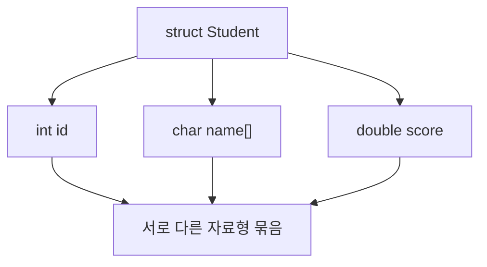

# 160 C언어의 구조체

작성 기준일: 2026-06-01
검색/보강일: 2026-06-01
PDF 확인 위치: 23페이지, 4과목 프로그래밍 언어 활용, 160 C언어의 구조체

## 한 줄 요약

- C언어의 구조체는 서로 다른 자료형의 변수를 하나의 사용자 정의 자료형처럼 묶기 위해 `struct` 예약어로 정의하는 자료 구조이다.



## 한눈에 보는 구조

| 구분 | 내용 |
|---|---|
| 예약어 | struct |
| 목적 | 자료 종류가 다른 변수들을 하나로 묶음 |
| 성격 | 사용자 정의 자료형 |
| 접근 | 구조체변수.멤버 |
| 예 | 학생의 학번, 이름, 점수 묶기 |

## PDF 기준 핵심

- 구조체는 자료의 종류가 다른 변수의 모임이다.
- 예약어 `struct`를 이용해 정의한다.

## 개념 설명

### 구조체의 의미

- 구조체는 관련 있는 여러 값을 하나의 단위로 묶는다.
- cppreference는 `struct`를 C 언어의 구조체와 union, bit-field와 함께 설명한다.
- 배열은 같은 자료형 원소를 묶는 데 주로 쓰이고, 구조체는 서로 다른 자료형을 묶는 데 적합하다.

### 기본 형태

```c
struct Student {
    int id;
    char name[20];
    double score;
};
```

- `id`, `name`, `score`는 구조체 멤버이다.
- 구조체 변수를 만든 뒤 `.` 연산자로 멤버에 접근한다.

## 시험 포인트

- 구조체는 서로 다른 자료형 변수를 묶는다.
- C언어 예약어는 `struct`이다.
- 배열은 같은 자료형 중심, 구조체는 다른 자료형 묶음으로 구분한다.
- 구조체 멤버 접근은 `.` 연산자와 연결된다.

## 헷갈리는 비교

| 비교 | 배열 | 구조체 |
|---|---|---|
| 구성 | 같은 자료형 원소 | 서로 다른 자료형 멤버 |
| 접근 | 인덱스 | 멤버 이름 |
| 예 | 점수 5개 | 학생의 학번, 이름, 점수 |

## 예시 또는 암기 포인트

```c
struct Student s;
s.id = 1;
s.score = 95.5;
```

- 암기 문장: 구조체 = `다른 타입을 한 묶음으로`

## 빠른 복습

- 구조체는 C언어에서 `struct`로 정의한다.
- 자료 종류가 다른 변수의 모임이다.
- 사용자 정의 자료형처럼 사용할 수 있다.
- 배열과 구조체의 차이를 구분한다.

## 참고 링크

- [cppreference - C struct declaration](https://en.cppreference.com/w/c/language/struct)
- [cppreference - C language](https://en.cppreference.com/w/c/language)

