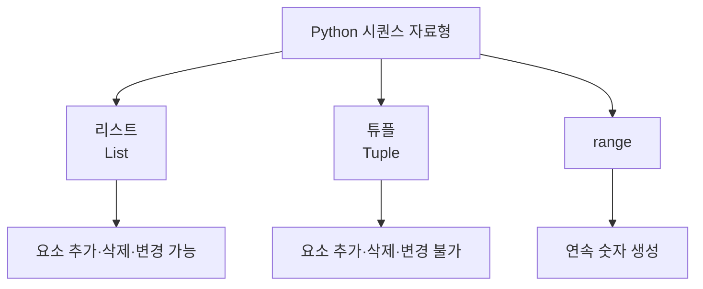

# 161 Python의 시퀀스 자료형

작성 기준일: 2026-06-01
검색/보강일: 2026-06-01
PDF 확인 위치: 23페이지, 4과목 프로그래밍 언어 활용, 161 Python의 시퀀스 자료형

## 한 줄 요약

- Python의 대표 시퀀스 자료형은 리스트, 튜플, range이며, 순서가 있는 여러 값을 저장하거나 생성하는 데 사용된다.



## 한눈에 보는 구조

| 자료형 | PDF 기준 핵심 | 특징 |
|---|---|---|
| 리스트 | 필요에 따라 개수를 늘리거나 줄일 수 있음 | 변경 가능 |
| 튜플 | 요소의 추가, 삭제, 변경은 불가능함 | 변경 불가 |
| range | 연속된 숫자를 생성함 | 반복문에 자주 사용 |

## PDF 기준 핵심

- 리스트(List): 필요에 따라 개수를 늘리거나 줄일 수 있다.
- 튜플(Tuple): 요소의 추가, 삭제, 변경은 불가능하다.
- range: 연속된 숫자를 생성한다.

## 개념 설명

### 시퀀스의 의미

- Python 공식 문서는 `list`, `tuple`, `range`를 대표적인 sequence types로 설명한다.
- 시퀀스는 순서가 있고, 인덱스로 접근할 수 있는 자료형이다.
- 문자열도 시퀀스 성격을 가지지만, PDF 161의 핵심은 리스트, 튜플, range이다.

### 리스트

- 대괄호 `[]`로 만들 수 있다.
- 변경 가능한 mutable sequence이다.
- 예:
  - `a = [1, 2, 3]`
  - `a[0] = 10`

### 튜플

- 괄호 `()`로 만들 수 있다.
- 변경 불가능한 immutable sequence이다.
- 예:
  - `t = (1, 2, 3)`

### range

- 연속된 정수 범위를 나타낸다.
- 반복문에서 자주 사용한다.
- `range(5)`는 0부터 4까지의 값을 생성한다.

## 시험 포인트

- 리스트는 개수를 늘리거나 줄일 수 있다.
- 튜플은 추가, 삭제, 변경이 불가능하다.
- range는 연속된 숫자를 생성한다.
- Python 인덱스는 보통 0부터 시작한다.
- 리스트와 튜플의 변경 가능 여부를 반드시 구분한다.

## 헷갈리는 비교

| 비교 | 리스트 | 튜플 |
|---|---|---|
| 변경 | 가능 | 불가능 |
| 표기 | `[]` | `()` |
| 용도 | 변경 가능한 데이터 묶음 | 고정된 데이터 묶음 |

## 예시 또는 암기 포인트

```python
a = [1, 2, 3]
t = (1, 2, 3)
r = range(1, 5)
```

- 암기 문장: `리스트는 바꾸고, 튜플은 고정, range는 숫자 생성`

## 빠른 복습

- Python 시퀀스 자료형에는 리스트, 튜플, range가 있다.
- 리스트는 변경 가능하다.
- 튜플은 변경 불가능하다.
- range는 연속 숫자를 생성한다.
- 순서가 있으므로 인덱스로 접근한다.

## 참고 링크

- [Python Documentation - Built-in Types: Sequence Types](https://docs.python.org/3/library/stdtypes.html#sequence-types-list-tuple-range)

