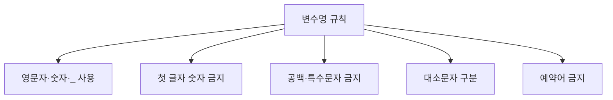

# 162 변수명 작성 규칙

작성 기준일: 2026-06-01
검색/보강일: 2026-06-01
PDF 확인 위치: 23페이지, 4과목 프로그래밍 언어 활용, 162 변수명 작성 규칙

## 한 줄 요약

- 변수명은 영문자, 숫자, 밑줄을 사용할 수 있지만 숫자로 시작할 수 없고, 공백·특수문자·예약어는 사용할 수 없으며 대소문자를 구분한다.

## 한눈에 보는 구조

| 규칙 | 가능 여부 |
|---|---|
| 영문자 | 가능 |
| 숫자 | 가능하지만 첫 글자는 불가 |
| `_` | 가능 |
| 공백 | 불가 |
| `*`, `+`, `-`, `/` | 불가 |
| 예약어 | 불가 |

## PDF 기준 핵심

- 영문자, 숫자, `_`를 사용할 수 있다.
- 첫 글자는 숫자가 올 수 없다.
- 공백이나 `*`, `+`, `-`, `/` 등의 특수문자를 사용할 수 없다.
- 대·소문자를 구분한다.
- 예약어를 변수명으로 사용할 수 없다.

## 개념 설명

### 식별자의 의미

- 변수명은 프로그램에서 값을 저장하는 이름, 즉 식별자이다.
- Python 공식 문서는 식별자가 문자 또는 밑줄로 시작하고 이후 문자, 숫자, 밑줄 등이 올 수 있음을 설명한다.
- Java도 식별자와 키워드 규칙을 따르며, 예약어는 식별자로 사용할 수 없다.

### 예시

- 가능한 변수명:
  - `score`
  - `score1`
  - `_count`
  - `student_name`
- 불가능한 변수명:
  - `1score`
  - `student name`
  - `a+b`
  - `for`

## 시험 포인트

- 숫자는 첫 글자로 올 수 없다.
- 밑줄 `_`은 사용할 수 있다.
- 공백은 사용할 수 없다.
- 대소문자는 구분한다.
- 예약어는 변수명으로 사용할 수 없다.

## 헷갈리는 비교

| 변수명 | 판단 | 이유 |
|---|---|---|
| `score2` | 가능 | 숫자가 첫 글자가 아님 |
| `2score` | 불가 | 숫자로 시작 |
| `score_name` | 가능 | 밑줄 사용 |
| `score-name` | 불가 | `-` 특수문자 사용 |
| `while` | 불가 | 예약어 |

## 예시 또는 암기 포인트

- 암기 문장: `첫 글자 숫자 금지, 공백 금지, 예약어 금지`
- 대문자 `Score`와 소문자 `score`는 다른 이름으로 취급될 수 있다.

## 빠른 복습

- 변수명에는 영문자, 숫자, `_`를 사용할 수 있다.
- 첫 글자는 숫자가 될 수 없다.
- 공백과 특수문자는 사용할 수 없다.
- 대소문자를 구분한다.
- 예약어는 변수명으로 사용할 수 없다.

## 참고 링크

- [Python Documentation - Lexical analysis: Identifiers](https://docs.python.org/3/reference/lexical_analysis.html#identifiers)
- [Java Language Specification - Lexical Structure](https://docs.oracle.com/en/java/javase/26/docs/specs/jls/jls-3.html)
