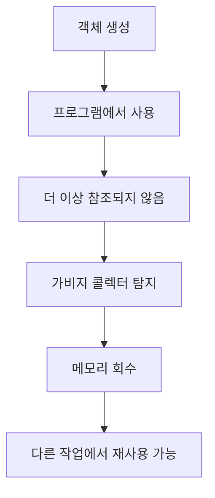

# 163 가비지 콜렉터(Garbage Collector)

작성 기준일: 2026-06-01
검색/보강일: 2026-06-01
PDF 확인 위치: 24페이지, 4과목 프로그래밍 언어 활용, 163 가비지 콜렉터(Garbage Collector)

## 한 줄 요약

- 가비지 콜렉터는 더 이상 사용되지 않는 객체가 차지한 메모리를 자동으로 회수해 다른 프로그램이나 객체가 사용할 수 있게 하는 메모리 관리 기능이다.

## 한눈에 보는 구조

| 구분 | 내용 |
|---|---|
| 대상 | 더 이상 사용되지 않는 객체·메모리 |
| 목적 | 메모리 공간 회수 |
| 성격 | 자동 메모리 관리 |
| 대표 언어 | Java, Python 등 |
| 주의 | 회수 시점은 언어와 런타임에 따라 달라짐 |

## PDF 기준 핵심

- 선언만 하고 사용하지 않는 변수들이 점유한 메모리 공간을 강제로 해제하여 다른 프로그램들이 사용할 수 있도록 하는 것이다.

## 개념 설명

### 가비지 콜렉션의 의미

- Java의 가비지 컬렉션은 더 이상 참조되지 않는 객체의 메모리를 회수하는 자동 메모리 관리 기능으로 이해한다.
- Python 공식 `gc` 문서는 순환 참조를 탐지하고 수집하는 garbage collector 인터페이스를 제공한다고 설명한다.
- C처럼 개발자가 `malloc/free`로 직접 메모리를 관리하는 언어와 대비된다.

### 왜 필요한가

- 사용하지 않는 객체가 메모리를 계속 차지하면 메모리 누수가 생길 수 있다.
- 가비지 콜렉터는 더 이상 접근할 수 없는 객체를 찾아 메모리를 회수한다.
- 개발자는 메모리 해제를 직접 하지 않아도 되는 편의성을 얻지만, 회수 시점과 성능 영향은 고려해야 한다.

## 시험 포인트

- 가비지 콜렉터는 사용하지 않는 메모리 공간을 회수한다.
- 자동 메모리 관리 기능이다.
- Java, Python 같은 언어와 연결된다.
- C의 `free`처럼 개발자가 직접 해제하는 방식과 구분한다.
- PDF 표현의 핵심은 `메모리 공간을 해제하여 다른 프로그램들이 사용`이다.

## 헷갈리는 비교

| 비교 | 가비지 콜렉터 | 수동 메모리 해제 |
|---|---|---|
| 수행 주체 | 런타임 | 개발자 |
| 예 | Java GC, Python gc | C의 free |
| 장점 | 편의성, 메모리 누수 감소 | 제어 가능성 |
| 주의 | 회수 시점 예측 어려움 | 해제 누락·중복 해제 위험 |

## 예시 또는 암기 포인트

- 객체를 만들었지만 더 이상 어떤 변수도 그 객체를 가리키지 않으면 회수 대상이 될 수 있다.
- 암기 문장: Garbage Collector = `안 쓰는 메모리 청소 담당`

## 빠른 복습

- 가비지 콜렉터는 Garbage Collector이다.
- 더 이상 사용하지 않는 메모리를 회수한다.
- 다른 프로그램이나 객체가 메모리를 사용할 수 있게 한다.
- 자동 메모리 관리와 연결한다.

## 참고 링크

- [Python Documentation - gc: Garbage Collector interface](https://docs.python.org/3/library/gc.html)
- [Oracle Java SE Troubleshooting - Garbage Collection](https://docs.oracle.com/javase/8/docs/technotes/guides/troubleshoot/memleaks002.html)

