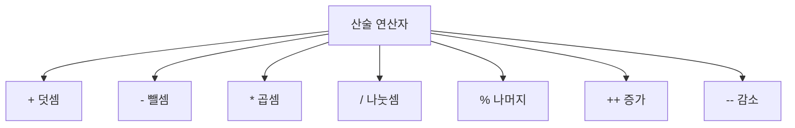

# 164 산술 연산자

작성 기준일: 2026-06-01
검색/보강일: 2026-06-01
PDF 확인 위치: 24페이지, 4과목 프로그래밍 언어 활용, 164 산술 연산자

## 한 줄 요약

- 산술 연산자는 덧셈, 뺄셈, 곱셈, 나눗셈, 나머지, 증가, 감소처럼 수치 계산에 사용하는 연산자이다.



## 한눈에 보는 구조

| 연산자 | 의미 | 시험 단서 |
|---|---|---|
| `%` | 나머지 | 정수 연산 중심 |
| `++` | 증가 | 전치·후치 구분 |
| `--` | 감소 | 전치·후치 구분 |
| `+`, `-`, `*`, `/` | 기본 사칙연산 | 우선순위 주의 |

## PDF 기준 핵심

- `%`: 나머지 연산자이다. PDF는 정수만 연산할 수 있으며 실수를 사용하면 오류가 발생한다고 설명한다.
- `++`: 증가 연산자이다.
- `--`: 감소 연산자이다.
- 전치:
  - 변수 앞에 증감 연산자가 오는 형태이다.
  - 먼저 변수 값을 증감시킨 후 변수를 연산에 사용한다.
- 후치:
  - 변수 뒤에 증감 연산자가 오는 형태이다.
  - 먼저 변수를 연산에 사용한 후 변수 값을 증감시킨다.

## 개념 설명

### 나머지 연산자

- C와 Java에서 `%`는 나머지를 구하는 연산자이다.
- 시험 PDF는 정수 중심으로 설명하므로 `나머지 = 정수 연산 단서`로 기억한다.

### 전치와 후치

- 전치 증가 `++a`:
  - 먼저 a를 1 증가시키고, 증가된 값을 식에 사용한다.
- 후치 증가 `a++`:
  - 먼저 현재 a 값을 식에 사용하고, 그 뒤 a를 1 증가시킨다.
- 감소 연산자도 같은 방식으로 동작한다.

## 시험 포인트

- `%`는 나머지이다.
- `++`는 증가, `--`는 감소이다.
- 전치는 먼저 증감 후 사용한다.
- 후치는 먼저 사용 후 증감한다.
- 산술 연산자는 연산자 우선순위 문제와 함께 자주 출제된다.

## 헷갈리는 비교

| 비교 | 전치 | 후치 |
|---|---|---|
| 형태 | `++a`, `--a` | `a++`, `a--` |
| 순서 | 증감 후 사용 | 사용 후 증감 |
| 문제 단서 | 먼저 바뀐 값 | 현재 값 먼저 |

## 예시 또는 암기 포인트

```c
int a = 3;
int b = ++a;  // a = 4, b = 4
int c = a++;  // c = 4, a = 5
```

- 암기 문장: `앞에 있으면 먼저, 뒤에 있으면 나중`

## 빠른 복습

- 산술 연산자는 수치 계산에 사용한다.
- `%`는 나머지 연산자이다.
- `++`는 증가, `--`는 감소이다.
- 전치와 후치의 평가 순서를 구분한다.

## 참고 링크

- [cppreference - C operators](https://en.cppreference.com/w/c/language/operators)
- [cppreference - C operator precedence](https://docs.cppreference.com/w/c/language/operator_precedence.html)

<!-- study-links:start -->
## 관련 문서

- `연산자 우선순위`: [[정보처리기사/4과목 프로그래밍 언어 활용/168 연산자 우선순위/168 연산자 우선순위|168 연산자 우선순위]]
<!-- study-links:end -->
