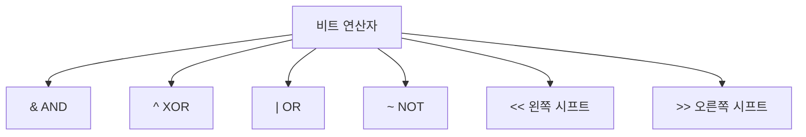

# 165 비트 연산자

작성 기준일: 2026-06-01
검색/보강일: 2026-06-01
PDF 확인 위치: 24페이지, 4과목 프로그래밍 언어 활용, 165 비트 연산자

## 한 줄 요약

- 비트 연산자는 정수 값을 비트 단위로 AND, OR, XOR, NOT하거나 왼쪽·오른쪽으로 이동시키는 연산자이다.

## 한눈에 보는 구조

| 연산자 | 의미 | PDF 기준 핵심 |
|---|---|---|
| `&` | AND | 모든 비트가 1일 때만 1 |
| `^` | XOR | 같으면 0, 다르면 1 |
| `|` | OR | 하나라도 1이면 1 |
| `~` | NOT | 각 비트의 부정 |
| `<<` | 왼쪽 시프트 | 비트를 왼쪽으로 이동 |
| `>>` | 오른쪽 시프트 | 비트를 오른쪽으로 이동 |

## PDF 기준 핵심

- `& (and)`: 모든 비트가 1일 때만 1이다.
- `^ (xor)`: 모든 비트가 같으면 0, 하나라도 다르면 1이다.
- `| (or)`: 모든 비트 중 한 비트라도 1이면 1이다.
- `~ (not)`: 각 비트의 부정이며, 0이면 1, 1이면 0이다.
- `<<`: 비트를 왼쪽으로 이동한다.
- `>>`: 비트를 오른쪽으로 이동한다.

## 개념 설명

### 비트 단위 연산

- 비트 연산자는 숫자를 2진수 비트열로 보고 각 자리별로 계산한다.
- C와 Java 모두 비트 연산자를 제공한다.
- cppreference는 C의 bitwise AND, OR, XOR, NOT, shift 연산을 operator 체계 안에서 설명한다.

### 시프트 연산

- `<<`는 비트를 왼쪽으로 이동한다.
- `>>`는 비트를 오른쪽으로 이동한다.
- 정수 값에서 왼쪽 시프트는 보통 2의 거듭제곱 곱셈과 비슷한 효과가 있지만, 오버플로우나 부호 처리에는 주의해야 한다.

## 시험 포인트

- `&`는 둘 다 1일 때 1이다.
- `|`는 하나라도 1이면 1이다.
- `^`는 다르면 1이다.
- `~`는 0과 1을 반전한다.
- `<<`, `>>`는 방향을 묻는 문제가 나온다.

## 헷갈리는 비교

| 비교 | AND `&` | OR `|` | XOR `^` |
|---|---|---|---|
| 0,0 | 0 | 0 | 0 |
| 0,1 | 0 | 1 | 1 |
| 1,0 | 0 | 1 | 1 |
| 1,1 | 1 | 1 | 0 |

## 예시 또는 암기 포인트

- AND: 둘 다 켜져야 켜짐
- OR: 하나라도 켜지면 켜짐
- XOR: 서로 다르면 켜짐
- NOT: 반대로 뒤집음

## 빠른 복습

- 비트 연산자는 비트 단위로 계산한다.
- `&`, `^`, `|`, `~`, `<<`, `>>`를 외운다.
- AND는 모두 1, OR은 하나라도 1, XOR은 다르면 1이다.
- 시프트는 비트를 좌우로 이동한다.

## 참고 링크

- [cppreference - C operators](https://en.cppreference.com/w/c/language/operators)
- [cppreference - C operator precedence](https://docs.cppreference.com/w/c/language/operator_precedence.html)

