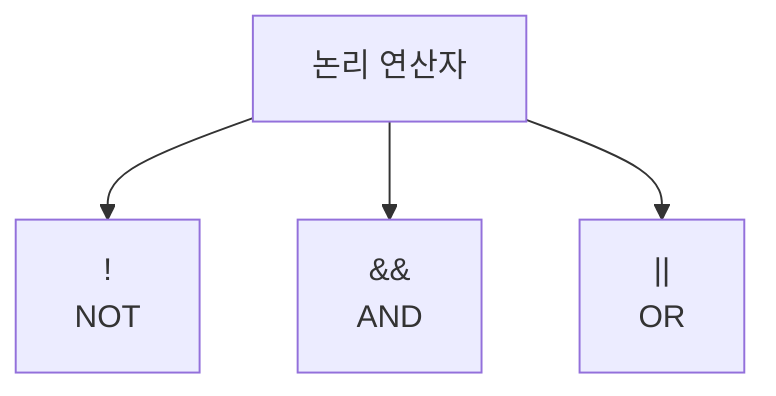

# 166 논리 연산자

작성 기준일: 2026-06-01
검색/보강일: 2026-06-01
PDF 확인 위치: 24페이지, 4과목 프로그래밍 언어 활용, 166 논리 연산자

## 한 줄 요약

- 논리 연산자는 조건식의 참과 거짓을 조합하거나 반전하는 연산자로, `!`, `&&`, `||`이 핵심이다.



## 한눈에 보는 구조

| 연산자 | 의미 | 결과 |
|---|---|---|
| `!` | 부정 | 참이면 거짓, 거짓이면 참 |
| `&&` | AND | 모두 참이면 참 |
| `||` | OR | 하나라도 참이면 참 |

## PDF 기준 핵심

- `! (not)`: 부정이다.
- `&& (and)`: 모두 참이면 참이다.
- `|| (or)`: 하나라도 참이면 참이다.

## 개념 설명

### 논리 연산의 의미

- 논리 연산자는 조건문과 반복문에서 조건식을 조합하는 데 자주 사용한다.
- C의 논리 연산자 `!`, `&&`, `||`는 cppreference의 C operator 체계에 포함된다.
- Java도 같은 형태의 논리 연산자를 사용한다.

### 단축 평가

- C와 Java에서 `&&`는 앞 조건이 거짓이면 뒤 조건을 평가하지 않을 수 있다.
- `||`는 앞 조건이 참이면 뒤 조건을 평가하지 않을 수 있다.
- 시험의 기본 개념 문제에서는 진리표와 의미가 우선이다.

## 시험 포인트

- `!`는 부정이다.
- `&&`는 모두 참일 때만 참이다.
- `||`는 하나라도 참이면 참이다.
- 비트 연산자 `&`, `|`와 논리 연산자 `&&`, `||`를 구분한다.
- 조건문 계산 문제에서 우선순위와 함께 출제될 수 있다.

## 헷갈리는 비교

| 비교 | `&&` | `||` |
|---|---|---|
| 조건 | 모두 참 | 하나라도 참 |
| 참이 되기 어려운 쪽 | `&&` | `||` |
| 예 | 로그인했고 권한도 있음 | 관리자이거나 소유자임 |

| 비교 | `&` | `&&` |
|---|---|---|
| 성격 | 비트 AND | 논리 AND |
| 대상 | 비트 | 참/거짓 조건 |

## 예시 또는 암기 포인트

```c
if (score >= 60 && attendance >= 80) {
    pass = 1;
}
```

- 암기 문장: `!는 뒤집고, &&는 모두, ||는 하나라도`

## 빠른 복습

- 논리 연산자는 조건식에 사용한다.
- `!`는 부정이다.
- `&&`는 AND이다.
- `||`는 OR이다.
- 비트 연산자와 기호를 구분한다.

## 참고 링크

- [cppreference - C operators](https://en.cppreference.com/w/c/language/operators)
- [Java Language Specification - Operators](https://docs.oracle.com/en/java/javase/26/docs/specs/jls/jls-15.html)

