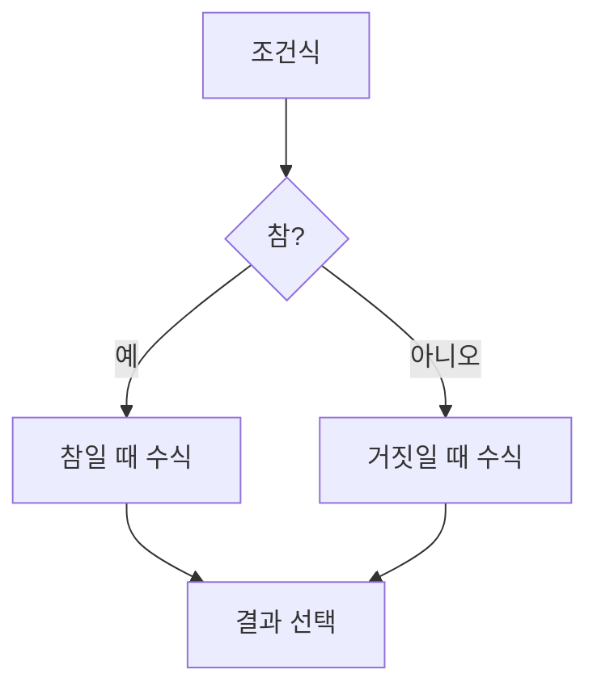

# 167 조건 연산자

작성 기준일: 2026-06-01
검색/보강일: 2026-06-01
PDF 확인 위치: 24페이지, 4과목 프로그래밍 언어 활용, 167 조건 연산자

## 한 줄 요약

- 조건 연산자 `? :`는 조건식의 참·거짓에 따라 두 수식 중 하나를 선택해 수행하는 삼항 연산자이다.



## 한눈에 보는 구조

| 구분 | 내용 |
|---|---|
| 기호 | `? :` |
| 피연산자 수 | 3개 |
| 다른 이름 | 삼항 연산자 |
| 역할 | 조건에 따라 다른 수식 선택 |
| 기본 형태 | `조건 ? 참일때값 : 거짓일때값` |

## PDF 기준 핵심

- 조건 연산자는 조건에 따라 서로 다른 수식을 수행한다.
- PDF 예:

```c
mx = a < b ? b : a;
```

- `a`가 `b`보다 작으면 `mx`에 `b`를 저장하고, 그렇지 않으면 `mx`에 `a`를 저장한다.

## 개념 설명

### 조건 연산자의 의미

- 조건 연산자는 `if-else`를 짧게 표현할 때 사용한다.
- C와 Java 모두 `? :` 형태의 conditional operator를 제공한다.
- cppreference의 C operator precedence 표에서 조건 연산자는 할당 연산자보다 높은 쪽에 위치하고 오른쪽 결합성을 가진다.

### 예시 해석

- `mx = a < b ? b : a;`
- 조건: `a < b`
- 참이면 선택: `b`
- 거짓이면 선택: `a`
- 결과적으로 큰 값을 `mx`에 저장하는 표현이다.

## 시험 포인트

- 조건 연산자의 기호는 `? :`이다.
- 피연산자가 세 개라서 삼항 연산자라고도 한다.
- 조건이 참이면 `?` 뒤의 수식이 선택된다.
- 조건이 거짓이면 `:` 뒤의 수식이 선택된다.
- 예제 계산 문제에서 먼저 조건을 판단한다.

## 헷갈리는 비교

| 비교 | 조건 연산자 | if문 |
|---|---|---|
| 형태 | 식 | 문장 |
| 표현 | `조건 ? A : B` | `if (조건) A else B` |
| 용도 | 간단한 선택 | 복잡한 분기 |

## 예시 또는 암기 포인트

```c
max = x > y ? x : y;
```

- `x > y`가 참이면 `x`, 거짓이면 `y`가 선택된다.
- 암기 문장: `물음표 뒤는 참, 콜론 뒤는 거짓`

## 빠른 복습

- 조건 연산자는 `? :`이다.
- 조건에 따라 서로 다른 수식을 선택한다.
- 삼항 연산자이다.
- 참이면 앞쪽, 거짓이면 뒤쪽을 사용한다.

## 참고 링크

- [cppreference - C operator precedence](https://docs.cppreference.com/w/c/language/operator_precedence.html)
- [Java Language Specification - Conditional Operator](https://docs.oracle.com/en/java/javase/26/docs/specs/jls/jls-15.html#jls-15.25)

<!-- study-links:start -->
## 관련 문서

- `조건 연산자`: [[정보처리기사/3과목 데이터베이스 구축/154 조건 연산자 - LIKE/154 조건 연산자 - LIKE|154 조건 연산자 - LIKE]]
<!-- study-links:end -->
