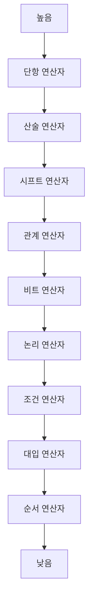

# 168 연산자 우선순위

작성 기준일: 2026-06-01
검색/보강일: 2026-06-01
PDF 확인 위치: 24페이지, 4과목 프로그래밍 언어 활용, 168 연산자 우선순위

## 한 줄 요약

- 연산자 우선순위는 하나의 식에 여러 연산자가 있을 때 어떤 연산을 먼저 묶어 계산할지 정하는 규칙이며, 단항·산술·시프트·관계·비트·논리·조건·대입·순서 연산자 순으로 이해한다.



## 한눈에 보는 구조

| 우선순위 흐름 | 대표 연산자 | 결합 규칙 |
|---|---|---|
| 단항 연산자 | `!`, `~`, `++`, `--`, `sizeof` | 오른쪽에서 왼쪽 |
| 산술 연산자 | `*`, `/`, `%`, `+`, `-` | 왼쪽에서 오른쪽 |
| 시프트 연산자 | `<<`, `>>` | 왼쪽에서 오른쪽 |
| 관계 연산자 | `<`, `<=`, `>=`, `>`, `==`, `!=` | 왼쪽에서 오른쪽 |
| 비트 연산자 | `&`, `^`, `|` | 왼쪽에서 오른쪽 |
| 논리 연산자 | `&&`, `||` | 왼쪽에서 오른쪽 |
| 조건 연산자 | `? :` | 오른쪽에서 왼쪽 |
| 대입 연산자 | `=`, `+=`, `-=`, `*=`, `/=`, `%=` 등 | 오른쪽에서 왼쪽 |
| 순서 연산자 | `,` | 왼쪽에서 오른쪽 |

## PDF 기준 핵심

- PDF는 연산자 우선순위를 높은 순서에서 낮은 순서로 표로 제시한다.
- 단항 연산자가 높다.
- 산술 연산자는 `* / %`가 `+ -`보다 우선한다.
- 시프트 연산자는 `<<`, `>>`이다.
- 관계 연산자는 비교와 동등성 비교를 포함한다.
- 비트 연산자는 `&`, `^`, `|` 순서로 제시된다.
- 논리 연산자는 `&&`, `||` 순서로 제시된다.
- 조건 연산자 `? :`, 대입 연산자, 순서 연산자 `,`는 낮은 편이다.

## 개념 설명

### 우선순위의 의미

- cppreference는 C 연산자 우선순위가 위에서 아래로 내려갈수록 낮아진다고 설명한다.
- 같은 행의 연산자는 결합 규칙에 따라 묶인다.
- 괄호를 사용하면 우선순위를 명확히 바꿀 수 있다.

### 계산 팁

- 먼저 괄호를 본다.
- 그다음 단항, 곱셈·나눗셈·나머지, 덧셈·뺄셈 순으로 계산한다.
- 비교, 비트, 논리, 조건, 대입 순으로 내려간다.
- 대입과 조건 연산자는 오른쪽 결합성을 가진다는 점을 기억한다.

## 시험 포인트

- `*`, `/`, `%`는 `+`, `-`보다 우선한다.
- 관계 연산자보다 산술 연산자가 먼저 계산된다.
- 비트 AND, XOR, OR 순서를 구분한다.
- 논리 AND가 논리 OR보다 우선한다.
- 대입 연산자는 우선순위가 낮고 오른쪽 결합이다.

## 헷갈리는 비교

| 비교 | 우선순위가 높은 쪽 |
|---|---|
| `*` vs `+` | `*` |
| `&&` vs `||` | `&&` |
| `&` vs `|` | `&` |
| 산술 vs 관계 | 산술 |
| 관계 vs 논리 | 관계 |

## 예시 또는 암기 포인트

```c
result = a + b * c > d && e;
```

- `b * c`가 먼저 계산된다.
- 그다음 `a + ...`가 계산된다.
- 이후 `> d` 비교가 수행된다.
- 마지막으로 `&& e`가 계산된다.

## 빠른 복습

- 연산자 우선순위는 계산 묶음 순서이다.
- 단항 연산자는 높고 순서 연산자 `,`는 낮다.
- 산술, 시프트, 관계, 비트, 논리, 조건, 대입 순서로 내려간다.
- 같은 우선순위에서는 결합 규칙을 본다.
- 헷갈리면 괄호를 사용한 식으로 바꿔 해석한다.

## 참고 링크

- [cppreference - C operator precedence](https://docs.cppreference.com/w/c/language/operator_precedence.html)
- [Java Language Specification - Expressions](https://docs.oracle.com/en/java/javase/26/docs/specs/jls/jls-15.html)

