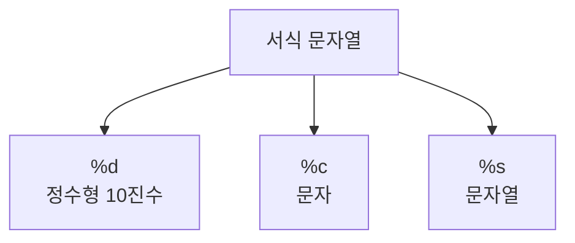

# 169 주요 서식 문자열

작성 기준일: 2026-06-01
검색/보강일: 2026-06-01
PDF 확인 위치: 24페이지, 4과목 프로그래밍 언어 활용, 169 주요 서식 문자열

## 한 줄 요약

- 주요 서식 문자열은 `printf` 같은 출력 함수에서 값의 출력 형태를 지정하는 문자열이며, PDF 핵심은 `%d`, `%c`, `%s`이다.



## 한눈에 보는 구조

| 서식 | 의미 |
|---|---|
| `%d` | 정수형 10진수 입·출력 |
| `%c` | 문자 입·출력 |
| `%s` | 문자열 입·출력 |

## PDF 기준 핵심

- `%d`: 정수형 10진수를 입·출력하기 위해 지정한다.
- `%c`: 문자를 입·출력하기 위해 지정한다.
- `%s`: 문자열을 입·출력하기 위해 지정한다.

## 개념 설명

- C의 `printf` 계열 함수는 형식 문자열(format string)에 있는 변환 지정자를 보고 값을 문자 형태로 변환해 출력한다.
- cppreference는 `printf`가 형식 문자열에 따라 값을 변환해 표준 출력에 쓴다고 설명한다.
- 시험에서는 많은 서식보다 `%d`, `%c`, `%s`의 의미를 빠르게 연결하는 것이 우선이다.

## 시험 포인트

- `%d`는 decimal integer, 즉 10진 정수이다.
- `%c`는 character, 문자이다.
- `%s`는 string, 문자열이다.
- 출력 결과 문제에서는 서식 문자열과 인수의 순서를 함께 본다.

## 헷갈리는 비교

| 서식 | 헷갈리는 점 | 구분 |
|---|---|---|
| `%d` | digit로 외우기 쉬움 | 정수형 10진수 |
| `%c` | 문자열과 혼동 | 문자 하나 |
| `%s` | 문자와 혼동 | 문자열 |

## 예시 또는 암기 포인트

```c
printf("%d %c %s", 10, 'A', "hello");
```

- 출력 방향: `10 A hello`
- 암기 문장: `d는 decimal, c는 character, s는 string`

## 빠른 복습

- `%d`는 정수형 10진수이다.
- `%c`는 문자이다.
- `%s`는 문자열이다.
- 서식 문자열은 출력 형태를 지정한다.

## 참고 링크

- [cppreference - std::printf](https://docs.cppreference.com/w/cpp/io/c/printf.html)
