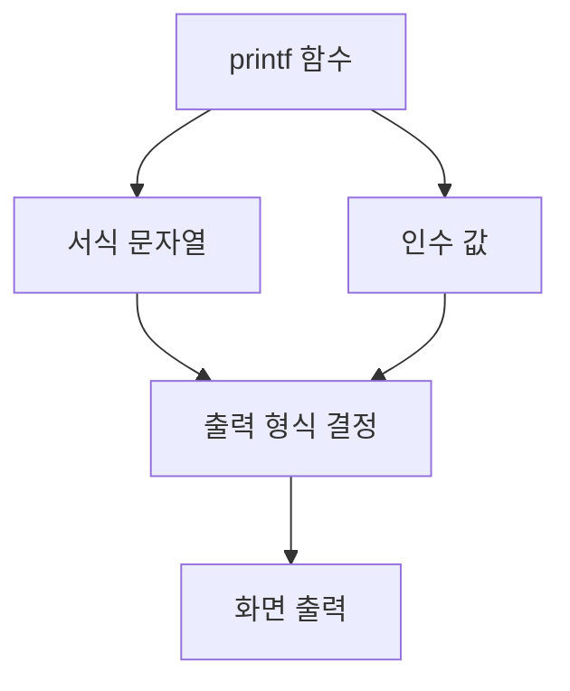

# 170 printf( ) 함수

작성 기준일: 2026-06-01
검색/보강일: 2026-06-01
PDF 확인 위치: 25페이지, 4과목 프로그래밍 언어 활용, 170 printf( ) 함수

## 한 줄 요약

- `printf()` 함수는 서식 문자열과 인수 값을 이용해 값을 화면에 형식화하여 출력하는 C 출력 함수이다.



## 한눈에 보는 구조

| 구분 | 내용 |
|---|---|
| 함수 | `printf()` |
| 목적 | 인수로 주어진 값을 화면에 출력 |
| 핵심 | 서식 문자열과 인수의 대응 |
| 예 | `printf("%d, %c", a, b);` |

## PDF 기준 핵심

- `printf()` 함수는 인수로 주어진 값을 화면에 출력하는 함수이다.
- PDF 예:

```c
printf("%d, %c", a, b);
```

- `a`의 값을 정수로 출력하고 쉼표와 공백 한 칸을 출력한 뒤, `b`의 값을 문자로 출력한다.

## 개념 설명

- `printf`는 C 표준 입출력 함수로, 형식 문자열에 맞춰 값을 출력한다.
- cppreference는 `printf`가 주어진 위치의 데이터를 문자 문자열 표현으로 변환해 출력한다고 설명한다.
- 서식 지정자 수와 인수 수·타입이 맞지 않으면 의도하지 않은 결과가 나올 수 있다.

## 시험 포인트

- `printf`는 화면 출력 함수이다.
- `%d`는 정수, `%c`는 문자, `%s`는 문자열이다.
- 서식 문자열에 있는 일반 문자도 그대로 출력된다.
- 인수는 서식 지정자의 순서대로 대응된다.

## 헷갈리는 비교

| 비교 | `printf` | `print` 계열 |
|---|---|---|
| C | 서식 기반 출력 함수 | 해당 언어별 별도 함수 |
| Java | `System.out.printf`가 형식 출력 | `print`, `println`은 일반 출력 |

## 예시 또는 암기 포인트

```c
int a = 10;
char b = 'Z';
printf("%d, %c", a, b);
```

- 결과: `10, Z`
- 암기 문장: `printf는 format에 맞춰 print`

## 빠른 복습

- `printf()`는 값을 화면에 출력한다.
- 서식 문자열과 인수가 대응된다.
- `%d`, `%c`, `%s`를 자주 사용한다.
- 일반 문자도 출력 문자열에 포함된다.

## 참고 링크

- [cppreference - std::printf](https://docs.cppreference.com/w/cpp/io/c/printf.html)

