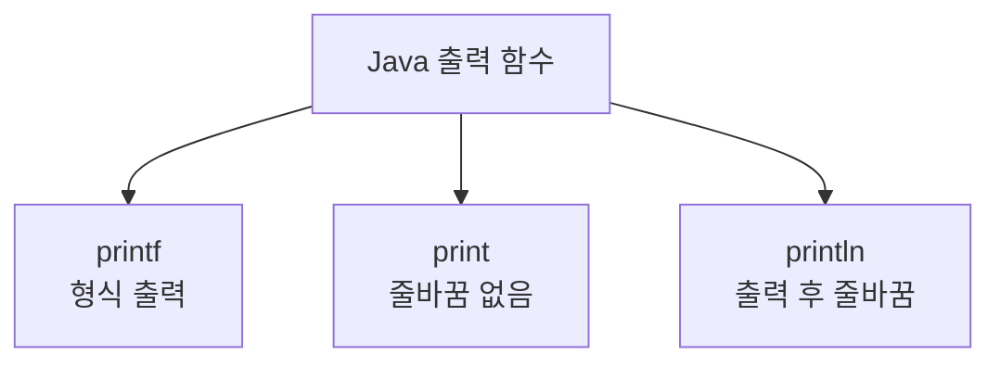

# 171 JAVA의 출력 함수

작성 기준일: 2026-06-01
검색/보강일: 2026-06-01
PDF 확인 위치: 25페이지, 4과목 프로그래밍 언어 활용, 171 JAVA의 출력 함수

## 한 줄 요약

- Java의 대표 출력 함수는 `printf`, `print`, `println`이며, `printf`는 형식 출력, `print`는 줄바꿈 없는 출력, `println`은 출력 후 줄바꿈을 수행한다.



## 한눈에 보는 구조

| 함수 | 역할 | PDF 예 |
|---|---|---|
| `printf()` | 서식에 맞춰 출력 | `System.out.printf("%d", r);` |
| `print()` | 값을 출력하고 줄바꿈하지 않음 | `System.out.print(r + s);` |
| `println()` | 값을 출력한 뒤 다음 줄로 이동 | `System.out.println(r + "은(는) 소수");` |

## PDF 기준 핵심

- `printf()`는 `r`의 값을 10진수 정수로 출력한다.
- `print()`는 `r`과 `s`를 더한 값을 출력한다.
- `println()`은 값을 출력한 후 커서를 다음 줄의 처음으로 옮긴다.

## 개념 설명

- Java의 `System.out`은 `PrintStream` 객체이다.
- Oracle Java API 문서는 `PrintStream.printf`를 지정한 format string과 arguments를 사용해 formatted string을 출력하는 편의 메서드로 설명한다.
- `println`은 출력 후 줄바꿈이 붙고, `print`는 줄바꿈이 붙지 않는다.

## 시험 포인트

- `printf`는 형식 출력이다.
- `print`는 줄바꿈 없이 출력한다.
- `println`은 출력 후 줄바꿈한다.
- 문자열 연결에서 `+`는 문자열 결합으로 동작할 수 있다.

## 헷갈리는 비교

| 비교 | print | println | printf |
|---|---|---|---|
| 줄바꿈 | 없음 | 있음 | 서식에 따라 다름 |
| 핵심 | 그대로 출력 | 출력 후 다음 줄 | format 출력 |
| 단서 | print | line | format |

## 예시 또는 암기 포인트

```java
System.out.print("A");
System.out.println("B");
System.out.printf("%d", 10);
```

- 암기 문장: `println의 ln은 line`

## 빠른 복습

- Java 출력 함수는 printf, print, println이다.
- printf는 형식 출력이다.
- print는 줄바꿈 없이 출력한다.
- println은 출력 후 줄바꿈한다.

## 참고 링크

- [Oracle Java API - PrintStream](https://docs.oracle.com/en/java/javase/11/docs/api/java.base/java/io/PrintStream.html)
