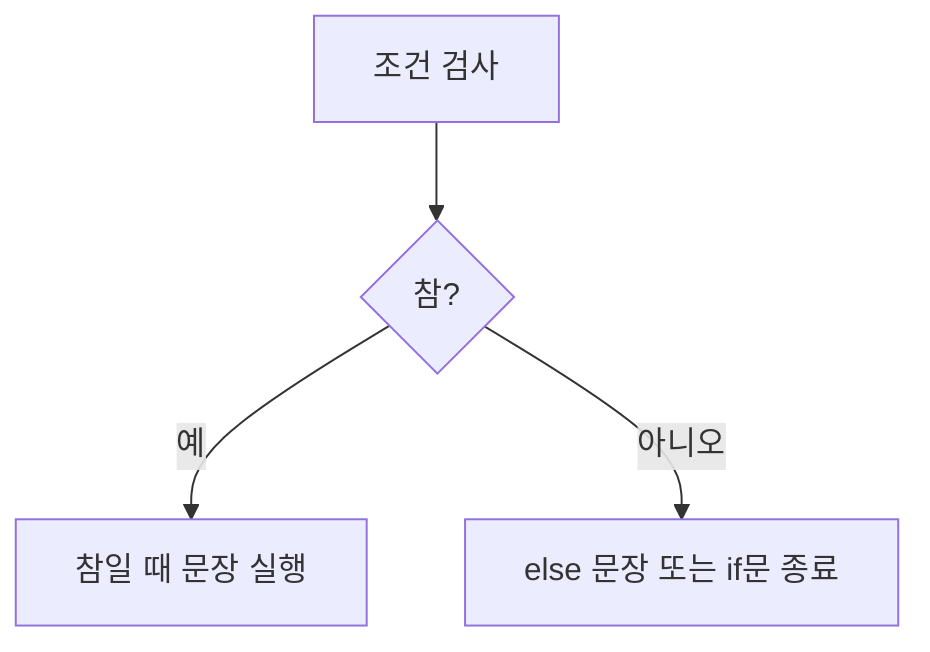

# 172 단순 if문

작성 기준일: 2026-06-01
검색/보강일: 2026-06-01
PDF 확인 위치: 25페이지, 4과목 프로그래밍 언어 활용, 172 단순 if문

## 한 줄 요약

- 단순 if문은 조건이 하나일 때 조건이 참이면 특정 문장을 실행하고, 필요하면 else로 거짓일 때의 문장도 지정하는 제어문이다.



## 한눈에 보는 구조

| 형태 | 의미 |
|---|---|
| `if (조건) 문장;` | 조건이 참일 때만 실행 |
| `if (조건) 문장1; else 문장2;` | 참과 거짓의 실행 문장이 다름 |

## PDF 기준 핵심

- 단순 if문은 조건이 한 개일 때 사용하는 제어문이다.
- 조건이 참일 때만 실행하는 경우가 있다.
- 조건이 참일 때와 거짓일 때 실행할 문장이 다른 경우가 있다.

## 개념 설명

- Java Tutorial은 if-then, if-then-else를 의사결정문으로 설명한다.
- C와 Java 모두 조건식의 결과에 따라 실행 흐름을 바꿀 수 있다.
- else는 바로 앞의 매칭 가능한 if와 연결된다는 점에 주의한다.

## 시험 포인트

- if문은 조건에 따라 실행 여부를 결정한다.
- 조건이 참이면 if 블록이 실행된다.
- else가 있으면 조건이 거짓일 때 else 블록이 실행된다.
- 단순 출력 결과 문제에서는 조건식을 먼저 계산한다.

## 헷갈리는 비교

| 비교 | if | switch |
|---|---|---|
| 기준 | 조건식 참/거짓 | 수식 값과 case 일치 |
| 용도 | 범위 조건, 복합 조건 | 여러 값 중 선택 |

## 예시 또는 암기 포인트

```c
if (a > b)
    printf("참");
else
    printf("거짓");
```

- 암기 문장: `if는 조건이 참이면 실행`

## 빠른 복습

- 단순 if문은 조건이 한 개일 때 사용한다.
- 조건이 참일 때만 실행할 수 있다.
- else를 사용하면 거짓일 때 실행 문장을 따로 지정한다.
- 조건식을 먼저 계산한다.

## 참고 링크

- [Oracle Java Tutorials - Control Flow Statements](https://www.sudo.es/docs/desarrollo/Java/documentacion_original_oracle_2017-SEPT/java/nutsandbolts/flow.html)
- [Java Language Specification - Blocks and Statements](https://docs.oracle.com/javase/specs/jls/se21/html/jls-14.html)

