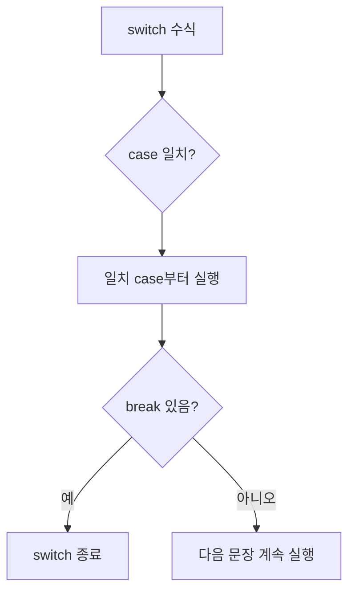

# 173 switch문

작성 기준일: 2026-06-01
검색/보강일: 2026-06-01
PDF 확인 위치: 25페이지, 4과목 프로그래밍 언어 활용, 173 switch문

## 한 줄 요약

- switch문은 수식 값에 따라 여러 case 중 하나로 분기하는 제어문이며, break가 없으면 다음 case 문장까지 이어서 실행될 수 있다.



## 한눈에 보는 구조

| 요소 | 의미 |
|---|---|
| switch | 분기 기준 수식 |
| case | 일치할 값 |
| break | switch문 탈출 |
| default | 일치 case가 없을 때 실행 |

## PDF 기준 핵심

- 조건에 따라 분기할 곳이 여러 곳인 경우 간단하게 처리할 수 있는 제어문이다.
- break문이 생략되면 수식과 레이블이 일치할 때 실행할 문장부터 break문 또는 switch문이 종료될 때까지 모든 문장이 실행된다.

## 개념 설명

- Java Language Specification은 switch문이 표현식 값에 따라 여러 문장 또는 표현식 중 하나로 제어를 이동한다고 설명한다.
- C의 switch도 case 레이블과 break 흐름을 사용한다.
- 시험에서는 break 생략 시 fall-through가 발생한다는 점이 매우 중요하다.

## 시험 포인트

- switch는 여러 분기 처리에 사용한다.
- case 값과 switch 수식 값이 일치하는 곳부터 실행한다.
- break가 있으면 switch를 탈출한다.
- break가 없으면 다음 case까지 이어질 수 있다.
- default는 일치하는 case가 없을 때 실행된다.

## 헷갈리는 비교

| 비교 | case | default |
|---|---|---|
| 실행 조건 | 값이 일치 | 일치 case가 없음 |
| 개수 | 여러 개 가능 | 보통 하나 |

## 예시 또는 암기 포인트

```c
switch (a) {
case 1:
    printf("바나나");
    break;
default:
    printf("없음");
}
```

- 암기 문장: `break 없으면 아래로 흐른다`

## 빠른 복습

- switch문은 여러 분기 처리에 사용한다.
- case는 값 일치 지점이다.
- break는 탈출이다.
- default는 기본 분기이다.
- break 생략 시 이어 실행될 수 있다.

## 참고 링크

- [Java Language Specification - The switch Statement](https://docs.oracle.com/javase/specs/jls/se21/html/jls-14.html#jls-14.11)
- [cppreference - C switch statement](https://en.cppreference.com/w/c/language/switch)
