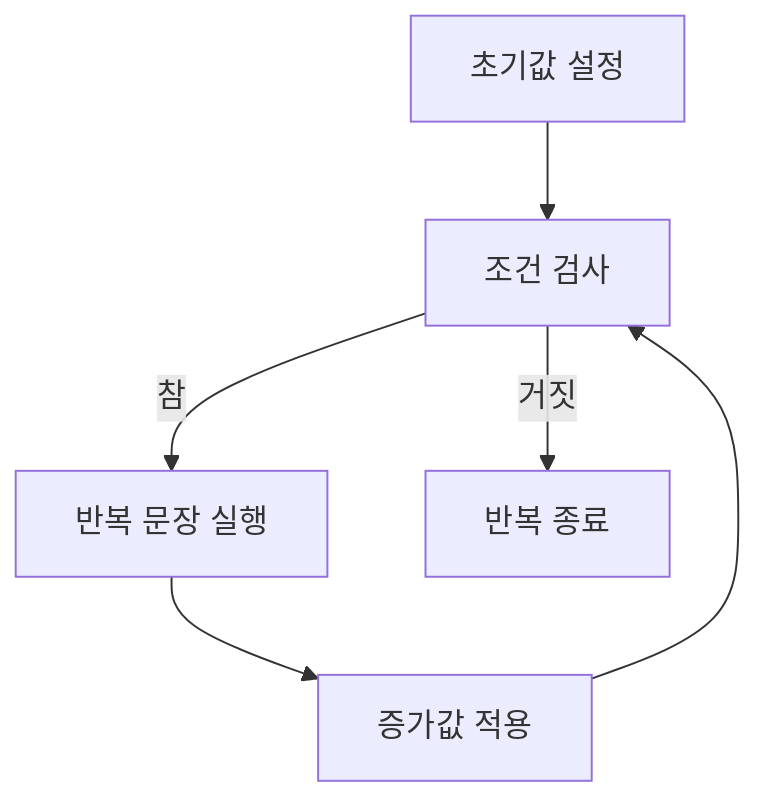

# 174 for문

작성 기준일: 2026-06-01
검색/보강일: 2026-06-01
PDF 확인 위치: 25페이지, 4과목 프로그래밍 언어 활용, 174 for문

## 한 줄 요약

- for문은 초기값, 조건식, 증가값을 이용해 정해진 횟수만큼 반복 수행하는 제어문이다.



## 한눈에 보는 구조

| 구성 | 역할 |
|---|---|
| 초기값 | 반복 변수 시작값 설정 |
| 조건식 | 반복 계속 여부 결정 |
| 실행문 | 반복 수행할 문장 |
| 증가값 | 반복 변수 변경 |

## PDF 기준 핵심

- for문은 초기값, 최종값, 증가값을 지정하는 수식을 이용해 정해진 횟수를 반복하는 제어문이다.
- PDF 예:

```c
for (i = 1; i <= 10; i++)
    sum = sum + i;
```

- 반복 변수 `i`가 1부터 1씩 증가하면서 10보다 작거나 같은 동안 `sum`에 `i` 값을 누적한다.

## 개념 설명

- Java Tutorial은 for문을 반복문 중 하나로 설명한다.
- for문은 반복 횟수가 비교적 명확할 때 읽기 쉽다.
- C/Java의 전통적 for문은 초기화, 조건, 갱신이 한 줄에 모인다.

## 시험 포인트

- for문은 정해진 횟수 반복에 적합하다.
- 실행 순서는 초기값 → 조건 검사 → 실행 → 증가값 → 조건 검사이다.
- 조건이 처음부터 거짓이면 한 번도 실행되지 않을 수 있다.
- 증가값이 빠지거나 조건이 계속 참이면 무한 반복이 될 수 있다.

## 헷갈리는 비교

| 비교 | for | while |
|---|---|---|
| 적합 | 반복 횟수 명확 | 조건 중심 반복 |
| 구성 | 초기값·조건·증가값이 한 줄 | 조건식 중심 |
| 첫 조건 거짓 | 실행 안 됨 | 실행 안 됨 |

## 예시 또는 암기 포인트

```c
for (i = 1; i <= 10; i++)
    sum += i;
```

- 암기 문장: `for는 시작, 조건, 변화가 한 줄`

## 빠른 복습

- for문은 반복 제어문이다.
- 초기값, 조건식, 증가값을 사용한다.
- 정해진 횟수 반복에 자주 사용한다.
- 조건이 거짓이면 종료한다.

## 참고 링크

- [Oracle Java Tutorials - Control Flow Statements](https://www.sudo.es/docs/desarrollo/Java/documentacion_original_oracle_2017-SEPT/java/nutsandbolts/flow.html)
- [Java Language Specification - The for Statement](https://docs.oracle.com/javase/specs/jls/se21/html/jls-14.html#jls-14.14)

