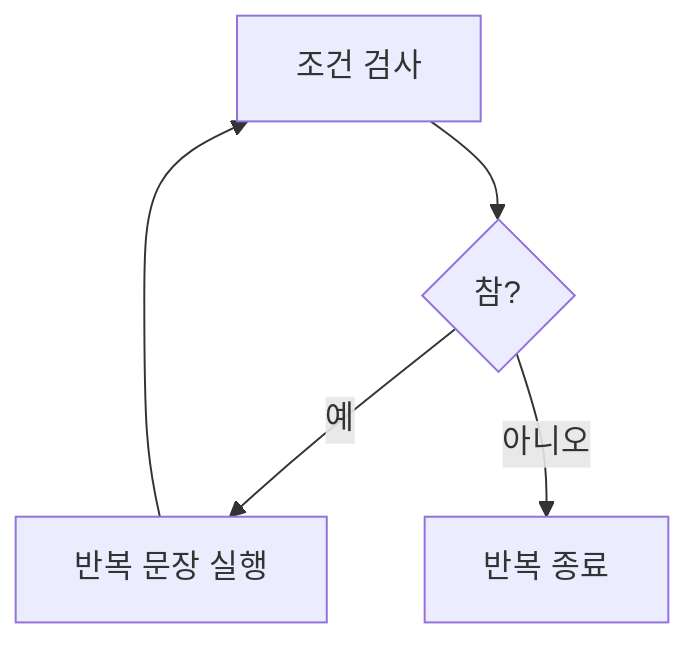

# 175 while문

작성 기준일: 2026-06-01
검색/보강일: 2026-06-01
PDF 확인 위치: 26페이지, 4과목 프로그래밍 언어 활용, 175 while문

## 한 줄 요약

- while문은 조건이 참인 동안 실행문을 반복 수행하는 조건 중심 반복문이다.



## 한눈에 보는 구조

| 구분 | 내용 |
|---|---|
| 형태 | `while (조건) 문장;` |
| 조건 검사 | 반복 전에 검사 |
| 첫 조건 거짓 | 한 번도 실행되지 않음 |
| 용도 | 반복 횟수보다 조건이 중요한 경우 |

## PDF 기준 핵심

- while문은 조건이 참인 동안 실행할 문장을 반복 수행하는 제어문이다.
- PDF 예:

```c
while (i <= 10)
    i = i + 1;
```

- `i`가 10보다 작거나 같은 동안 `i` 값을 1씩 누적시킨다.

## 개념 설명

- Java Tutorial은 while과 do-while을 반복문으로 설명한다.
- while문은 조건을 먼저 검사한다.
- 조건이 처음부터 거짓이면 실행문은 한 번도 수행되지 않는다.

## 시험 포인트

- while은 조건이 참인 동안 반복한다.
- 조건 검사가 먼저이다.
- 조건이 처음부터 거짓이면 0회 실행이다.
- do~while은 실행 후 조건 검사라 최소 1회 실행된다.

## 헷갈리는 비교

| 비교 | while | do~while |
|---|---|---|
| 조건 검사 | 실행 전 | 실행 후 |
| 최소 실행 횟수 | 0회 가능 | 1회 이상 |
| 형태 | `while (조건)` | `do ... while (조건);` |

## 예시 또는 암기 포인트

```c
while (i <= 10)
    i = i + 1;
```

- 암기 문장: `while은 먼저 묻고 실행`

## 빠른 복습

- while문은 조건 중심 반복문이다.
- 조건이 참인 동안 반복한다.
- 조건을 먼저 검사한다.
- 첫 조건이 거짓이면 실행하지 않는다.

## 참고 링크

- [Oracle Java Tutorials - Control Flow Statements](https://www.sudo.es/docs/desarrollo/Java/documentacion_original_oracle_2017-SEPT/java/nutsandbolts/flow.html)
- [Java Language Specification - The while Statement](https://docs.oracle.com/javase/specs/jls/se21/html/jls-14.html#jls-14.12)

