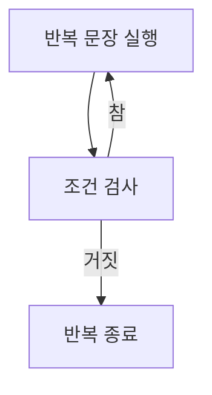

# 176 do~while문

작성 기준일: 2026-06-01
검색/보강일: 2026-06-01
PDF 확인 위치: 26페이지, 4과목 프로그래밍 언어 활용, 176 do~while문

## 한 줄 요약

- do~while문은 반복 문장을 먼저 한 번 실행한 뒤 조건을 검사하므로 조건이 처음에 거짓이어도 최소 한 번은 실행된다.



## 한눈에 보는 구조

| 구분 | 내용 |
|---|---|
| 형태 | `do 문장 while (조건);` |
| 조건 검사 | 실행 후 검사 |
| 최소 실행 | 1회 |
| 용도 | 적어도 한 번 실행해야 하는 반복 |

## PDF 기준 핵심

- 조건이 참인 동안 정해진 문장을 반복 수행하다가 조건이 거짓이면 반복문을 벗어난다.
- 실행할 문장을 무조건 한 번 실행한 다음 조건을 판단하여 탈출 여부를 결정한다.

## 개념 설명

- cppreference는 C do-while문에서 조건식이 각 반복 후 평가된다고 설명한다.
- Java에서도 do-while은 본문을 먼저 실행하고 조건을 나중에 평가한다.
- 조건 검사 위치가 while문과 반대라는 점이 핵심이다.

## 시험 포인트

- do~while은 최소 한 번 실행된다.
- 조건 검사는 반복문 끝에서 수행된다.
- while은 조건을 먼저 검사한다.
- 문장 끝의 세미콜론까지 주의한다.

## 헷갈리는 비교

| 비교 | while | do~while |
|---|---|---|
| 조건 검사 | 앞 | 뒤 |
| 첫 조건 거짓 | 0회 실행 | 1회 실행 |
| 시험 단서 | 조건이 참인 동안 | 무조건 한 번 실행 후 조건 판단 |

## 예시 또는 암기 포인트

```c
do
    i = i + 1;
while (i <= 10);
```

- 암기 문장: `do는 일단 하고 본다`

## 빠른 복습

- do~while은 반복문이다.
- 실행 후 조건을 검사한다.
- 최소 한 번은 실행된다.
- while문과 조건 검사 위치를 구분한다.

## 참고 링크

- [cppreference - C do-while loop](https://en.cppreference.com/w/c/language/do)
- [Java Language Specification - The do Statement](https://docs.oracle.com/javase/specs/jls/se21/html/jls-14.html#jls-14.13)

