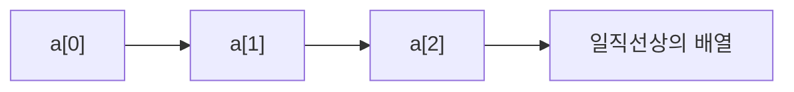

# 177 1차원 배열

작성 기준일: 2026-06-01
검색/보강일: 2026-06-01
PDF 확인 위치: 26페이지, 4과목 프로그래밍 언어 활용, 177 1차원 배열

## 한 줄 요약

- 1차원 배열은 같은 종류의 여러 변수를 일직선상으로 묶은 자료 구조이며, 인덱스를 사용해 각 요소에 접근한다.



## 한눈에 보는 구조

| 구분 | 내용 |
|---|---|
| 형태 | 일직선상의 요소 묶음 |
| 접근 | 인덱스 사용 |
| 시작 인덱스 | C에서 0부터 시작 |
| 예 | `char a[3] = {'A', 'B', 'C'};` |

## PDF 기준 핵심

- 1차원 배열은 변수들을 일직선상의 개념으로 조합한 배열이다.
- PDF 예:

```c
char a[3] = {'A', 'B', 'C'};
```

- 3개의 요소를 갖는 문자형 배열 `a`를 선언한다.

## 개념 설명

- 배열은 같은 타입의 요소를 연속적으로 다루는 자료 구조이다.
- C에서 배열 요소는 `a[0]`, `a[1]`, `a[2]`처럼 인덱스로 접근한다.
- Java도 배열을 사용하며, Oracle Java Tutorial은 배열을 같은 타입 값을 일정 개수 담는 컨테이너 객체로 설명한다.

## 시험 포인트

- 1차원 배열은 일직선상 구조이다.
- C 배열 인덱스는 0부터 시작한다.
- `char a[3]`은 3개의 요소를 가진다.
- 마지막 인덱스는 크기 - 1이다.
- 문자열 배열과 일반 문자 배열을 구분한다.

## 헷갈리는 비교

| 비교 | 1차원 배열 | 2차원 배열 |
|---|---|---|
| 형태 | 선 | 행과 열 |
| 인덱스 | 하나 | 두 개 |
| 예 | `a[3]` | `b[2][3]` |

## 예시 또는 암기 포인트

```c
char a[3] = {'A', 'B', 'C'};
```

- `a[0] = 'A'`
- `a[1] = 'B'`
- `a[2] = 'C'`
- 암기 문장: `배열은 0번부터`

## 빠른 복습

- 1차원 배열은 일직선상의 배열이다.
- 같은 종류의 여러 값을 묶는다.
- 인덱스로 접근한다.
- C에서는 인덱스가 0부터 시작한다.

## 참고 링크

- [cppreference - C array declaration](https://en.cppreference.com/w/c/language/array)
- [Oracle Java Tutorials - Arrays](https://docs.oracle.com/javase/tutorial/java/nutsandbolts/arrays.html)

