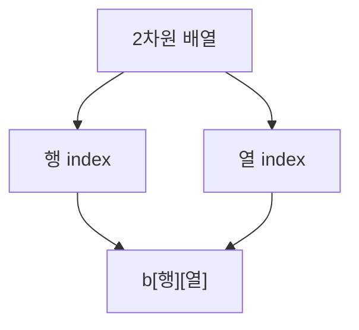

# 178 2차원 배열

작성 기준일: 2026-06-01
검색/보강일: 2026-06-01
PDF 확인 위치: 26페이지, 4과목 프로그래밍 언어 활용, 178 2차원 배열

## 한 줄 요약

- 2차원 배열은 변수를 행과 열의 평면 구조로 묶은 배열이며, 두 개의 인덱스로 요소에 접근한다.



## 한눈에 보는 구조

| 구분 | 내용 |
|---|---|
| 형태 | 행과 열의 평면 구조 |
| 접근 | `배열명[행][열]` |
| 예 | `int b[2][3]` |
| 요소 수 | 행 수 × 열 수 |

## PDF 기준 핵심

- 2차원 배열은 변수들을 평면, 즉 행과 열로 조합한 배열이다.
- PDF 예:

```c
int b[2][3] = {{11, 22, 33}, {44, 55, 66}};
```

- 2개의 행과 3개의 열을 갖는 정수형 배열 `b`를 선언한다.

## 개념 설명

- 2차원 배열은 배열 안에 배열이 있는 구조로 이해할 수 있다.
- C에서는 `b[0][0]`, `b[0][1]`, `b[1][2]`처럼 접근한다.
- 2행 3열 배열은 총 6개의 요소를 가진다.

## 시험 포인트

- 2차원 배열은 행과 열이다.
- 인덱스가 두 개 필요하다.
- `int b[2][3]`은 2행 3열이다.
- 요소 수는 2 × 3 = 6이다.
- 인덱스는 0부터 시작한다.

## 헷갈리는 비교

| 표현 | 의미 |
|---|---|
| `b[0][0]` | 첫 번째 행, 첫 번째 열 |
| `b[0][2]` | 첫 번째 행, 세 번째 열 |
| `b[1][0]` | 두 번째 행, 첫 번째 열 |
| `b[1][2]` | 두 번째 행, 세 번째 열 |

## 예시 또는 암기 포인트

```c
int b[2][3] = {{11, 22, 33}, {44, 55, 66}};
```

- `b[0][0] = 11`
- `b[0][2] = 33`
- `b[1][0] = 44`
- `b[1][2] = 66`

## 빠른 복습

- 2차원 배열은 행과 열로 구성된다.
- 두 개의 인덱스를 사용한다.
- `b[2][3]`은 2행 3열이다.
- 요소 수는 행 수와 열 수의 곱이다.

## 참고 링크

- [cppreference - C array declaration](https://en.cppreference.com/w/c/language/array)
- [Oracle Java Tutorials - Arrays](https://docs.oracle.com/javase/tutorial/java/nutsandbolts/arrays.html)
