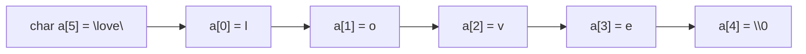

# 179 배열 형태의 문자열 변수

작성 기준일: 2026-06-01
검색/보강일: 2026-06-01
PDF 확인 위치: 26페이지, 4과목 프로그래밍 언어 활용, 179 배열 형태의 문자열 변수

## 한 줄 요약

- C언어에서 큰따옴표 문자열을 문자 배열에 저장하면 문자열 끝을 표시하는 널 문자 `'\0'`가 자동으로 붙는다.



## 한눈에 보는 구조

| 구분 | 내용 |
|---|---|
| 표현 | 큰따옴표 문자열 |
| 저장 | 문자 배열 |
| 끝 표시 | 널 문자 `'\0'` |
| 예 | `char a[5] = "love";` |

## PDF 기준 핵심

- C언어에서는 큰따옴표로 묶인 글자는 글자 수와 관계없이 문자열로 처리된다.
- 배열에 문자열을 저장하면 문자열의 끝을 알리기 위한 널 문자 `'\0'`가 문자열 끝에 자동으로 삽입된다.
- 예: `char a[5] = "love";`는 `l`, `o`, `v`, `e`, `\0`를 저장한다.

## 개념 설명

- cppreference는 `char str[] = "abc";`가 `a`, `b`, `c`, `\0`로 초기화되는 `char[4]` 배열이라고 설명한다.
- C 문자열은 널 종료 byte string으로 다루는 경우가 많다.
- 문자열 길이보다 배열 크기가 1 더 필요한 이유는 끝 표시 문자 `'\0'` 때문이다.

## 시험 포인트

- 큰따옴표는 문자열이다.
- C 문자열 배열 끝에는 `'\0'`가 붙는다.
- `"love"`는 글자 4개지만 배열 크기는 5가 필요하다.
- 작은따옴표 `'A'`는 문자 하나, 큰따옴표 `"A"`는 문자열이다.

## 헷갈리는 비교

| 표현 | 의미 |
|---|---|
| `'A'` | 문자 |
| `"A"` | 문자열, 내부적으로 `A`, `\0` |
| `char a[5] = "love"` | 4글자 + 널 문자 |

## 예시 또는 암기 포인트

```c
char a[5] = "love";
```

- `a[0] = 'l'`
- `a[1] = 'o'`
- `a[2] = 'v'`
- `a[3] = 'e'`
- `a[4] = '\0'`

## 빠른 복습

- C 문자열은 큰따옴표로 표현한다.
- 문자 배열에 저장할 수 있다.
- 문자열 끝에는 널 문자 `'\0'`가 들어간다.
- 배열 크기는 글자 수보다 1 크게 잡는 경우가 많다.

## 참고 링크

- [cppreference - C array declaration](https://cppreference.com/w/c/language/array.html)
- [cppreference - C string.h](https://en.cppreference.com/w/c/header/string)
