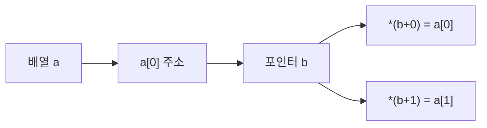

# 181 포인터와 배열

작성 기준일: 2026-06-01
검색/보강일: 2026-06-01
PDF 확인 위치: 27페이지, 4과목 프로그래밍 언어 활용, 181 포인터와 배열

## 한 줄 요약

- C에서 배열 이름은 많은 문맥에서 첫 번째 요소의 주소처럼 사용되므로, 포인터로 배열 요소에 접근할 수 있다.



## 한눈에 보는 구조

| 표현 | 의미 |
|---|---|
| `b = a;` | 배열 대표명 a가 첫 요소 주소처럼 사용됨 |
| `b = &a[0];` | 첫 번째 요소의 주소를 b에 저장 |
| `*(a+0)` | `a[0]`과 같은 위치 |
| `*(a+1)` | `a[1]`과 같은 위치 |

## PDF 기준 핵심

- 배열을 포인터 변수에 저장한 후 포인터를 이용해 배열의 요소에 접근할 수 있다.
- 배열 위치를 나타내는 첨자를 생략하고 배열의 대표명만 지정하면 배열의 첫 번째 요소의 주소를 지정하는 것과 같다.
- PDF 예:
  - `int a[5], *b`
  - `b = a;`
  - `b = &a[0];`

## 개념 설명

- cppreference는 배열 타입 표현식이 대부분의 문맥에서 첫 번째 요소를 가리키는 포인터로 변환된다고 설명한다.
- 그래서 `a`와 `&a[0]`는 배열 첫 요소 주소를 나타내는 문맥에서 같은 의미로 사용된다.
- 포인터 산술을 사용하면 `*(a+i)` 형태로 배열 요소에 접근할 수 있다.

## 시험 포인트

- 배열 대표명은 첫 번째 요소의 주소와 연결된다.
- `b = a;`와 `b = &a[0];`를 같은 방향으로 이해한다.
- `a[i]`는 `*(a+i)`와 연결된다.
- 포인터와 배열 문제는 인덱스가 0부터 시작한다는 점을 함께 본다.

## 헷갈리는 비교

| 배열 표기 | 포인터 표기 |
|---|---|
| `a[0]` | `*(a+0)` |
| `a[1]` | `*(a+1)` |
| `a[2]` | `*(a+2)` |

## 예시 또는 암기 포인트

```c
int a[5], *b;
b = a;
b = &a[0];
```

- 암기 문장: `배열 이름은 첫 칸 주소처럼 움직인다`

## 빠른 복습

- 배열은 포인터로 접근할 수 있다.
- 배열 대표명은 첫 번째 요소 주소와 연결된다.
- `b = a`와 `b = &a[0]`를 함께 기억한다.
- `a[i]`와 `*(a+i)`를 연결한다.

## 참고 링크

- [cppreference - C array declaration](https://cppreference.com/w/c/language/array.html)
- [cppreference - C pointer declaration](https://cppreference.com/w/c/language/pointer.html)

