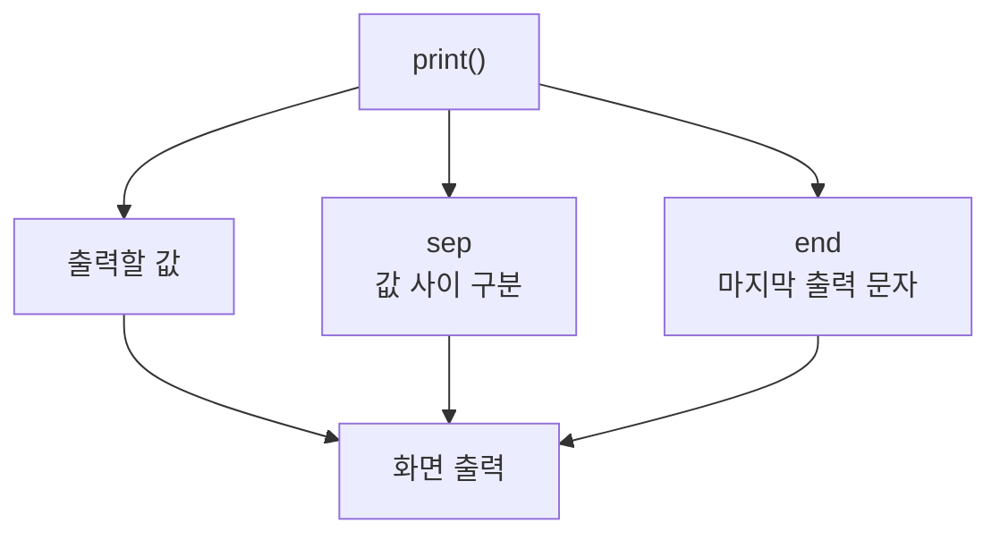

# 183 Python의 print( ) 함수

작성 기준일: 2026-06-01
검색/보강일: 2026-06-01
PDF 확인 위치: 27페이지, 4과목 프로그래밍 언어 활용, 183 Python의 print( ) 함수

## 한 줄 요약

- Python의 `print()` 함수는 인수로 받은 값을 화면에 출력하며, `sep`와 `end`로 값 사이 구분자와 출력 끝 문자를 지정할 수 있다.



## 한눈에 보는 구조

| 인수 | 의미 | 기본값 |
|---|---|---|
| 값들 | 출력할 대상 | 필요에 따라 여러 개 |
| `sep` | 값 사이 구분 문자 | 공백 |
| `end` | 출력 끝 문자 | 줄바꿈 |

## PDF 기준 핵심

- `print()` 함수는 인수로 주어진 값을 화면에 출력하는 함수이다.
- PDF 예:

```python
print(82, 24, sep='-', end=',')
```

- 결과는 `82-24,`이다.

## 개념 설명

- Python 공식 문서는 `print(*objects, sep=' ', end='\n', file=None, flush=False)` 형태로 설명한다.
- 여러 값을 출력하면 기본적으로 공백으로 구분된다.
- `sep`를 바꾸면 값 사이 문자를 바꿀 수 있다.
- `end`를 바꾸면 출력 끝의 줄바꿈 대신 다른 문자를 사용할 수 있다.

## 시험 포인트

- `sep`는 값 사이에 들어간다.
- `end`는 마지막에 들어간다.
- 기본 `end`는 줄바꿈이다.
- PDF 예의 결과 `82-24,`를 계산할 수 있어야 한다.

## 헷갈리는 비교

| 비교 | sep | end |
|---|---|---|
| 위치 | 값 사이 | 출력 끝 |
| 기본값 | 공백 | 줄바꿈 |
| 예 | `82-24`의 `-` | 마지막 `,` |

## 예시 또는 암기 포인트

```python
print(82, 24, sep='-', end=',')
```

- 결과: `82-24,`
- 암기 문장: `sep는 사이, end는 끝`

## 빠른 복습

- `print()`는 화면 출력 함수이다.
- `sep`는 값 사이 구분자이다.
- `end`는 출력 끝 문자이다.
- 여러 인수를 출력할 수 있다.

## 참고 링크

- [Python Documentation - print](https://docs.python.org/3/library/functions.html#print)
