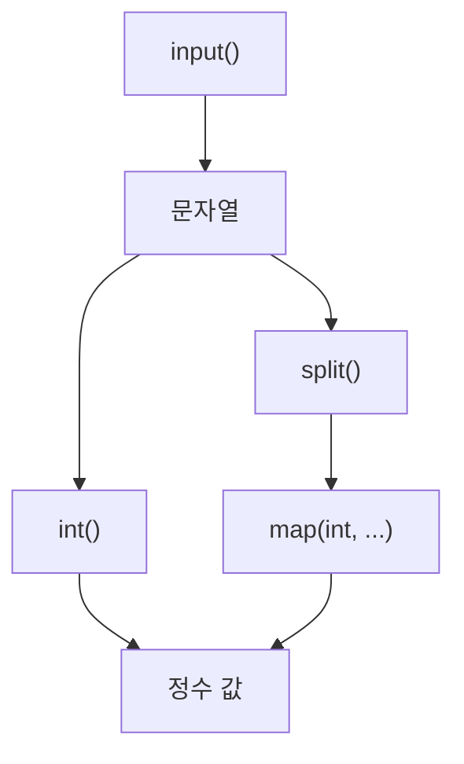

# 184 입력 값의 형변환

작성 기준일: 2026-06-01
검색/보강일: 2026-06-01
PDF 확인 위치: 27페이지, 4과목 프로그래밍 언어 활용, 184 입력 값의 형변환

## 한 줄 요약

- Python의 `input()`은 값을 문자열로 저장하므로 숫자로 사용하려면 `int()`와 `map()` 등을 이용해 형변환해야 한다.



## 한눈에 보는 구조

| 상황 | 표현 | 의미 |
|---|---|---|
| 데이터 1개 | `a = int(input())` | 입력값 하나를 정수 변환 |
| 데이터 2개 이상 | `a, b = map(int, input().split())` | 공백 분리 후 각각 정수 변환 |

## PDF 기준 핵심

- `input()` 함수는 입력되는 값을 무조건 문자열로 저장하므로 숫자로 사용하기 위해서는 형을 변환해야 한다.
- 변환할 데이터가 1개일 때:

```python
a = int(input())
```

- 변환할 데이터가 2개 이상일 때:

```python
a, b = map(int, input().split())
```

## 개념 설명

- `int()`는 문자열이나 숫자를 정수로 변환한다.
- `split()`은 문자열을 구분 기준에 따라 나누어 리스트를 만든다.
- `map(int, ...)`는 나뉜 각 문자열에 `int` 변환을 적용한다.
- 시험에서는 `input()은 문자열`이라는 출발점이 가장 중요하다.

## 시험 포인트

- 입력값은 기본적으로 문자열이다.
- 숫자 계산 전 형변환이 필요하다.
- 값 하나는 `int(input())`이다.
- 여러 값은 `map(int, input().split())` 패턴이다.
- `split()`은 입력 문자열을 나눈다.

## 헷갈리는 비교

| 표현 | 결과 |
|---|---|
| `input()` | 문자열 |
| `int(input())` | 정수 |
| `input().split()` | 문자열 리스트 |
| `map(int, input().split())` | 정수 변환 iterator |

## 예시 또는 암기 포인트

```python
a, b = map(int, input().split())
```

- 입력: `3 4`
- 결과: `a = 3`, `b = 4`
- 암기 문장: `입력은 문자열, 계산은 변환 후`

## 빠른 복습

- `input()`은 문자열을 반환한다.
- 숫자로 사용하려면 `int()`가 필요하다.
- 여러 입력은 `split()`으로 나눈다.
- `map(int, ...)`로 각각 정수 변환한다.

## 참고 링크

- [Python Documentation - input](https://docs.python.org/3/library/functions.html#input)
- [Python Documentation - int](https://docs.python.org/3/library/functions.html#int)
- [Python Documentation - map](https://docs.python.org/3/library/functions.html#map)
