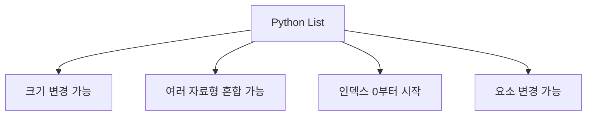

# 185 Python의 리스트(List)

작성 기준일: 2026-06-01
검색/보강일: 2026-06-01
PDF 확인 위치: 28페이지, 4과목 프로그래밍 언어 활용, 185 Python의 리스트(List)

## 한 줄 요약

- Python 리스트는 크기를 미리 지정하지 않고 여러 자료형을 섞어 저장할 수 있으며, 인덱스는 0부터 시작하고 요소 변경이 가능하다.



## 한눈에 보는 구조

| 특징 | 내용 |
|---|---|
| 크기 | 필요에 따라 늘리거나 줄일 수 있음 |
| 자료형 | 정수, 실수, 문자열 등 혼합 가능 |
| 인덱스 | 0부터 시작 |
| 생성 | `[]`, `list()` |
| 변경 | 요소 값 변경 가능 |

## PDF 기준 핵심

- 리스트는 필요에 따라 개수를 늘이거나 줄일 수 있어 선언할 때 크기를 적지 않는다.
- 배열과 달리 하나의 리스트에 정수, 실수, 문자열 등 다양한 자료형을 섞어서 저장할 수 있다.
- Python에서 리스트의 위치는 0부터 시작한다.
- 예:
  - `a = [10, 'mike', 23.45]`
  - `a = list([10, 'mike', 23.45])`
  - `a[0] = 1`

## 개념 설명

- Python 공식 자료구조 문서는 list를 다양한 메서드를 가진 자료구조로 설명한다.
- 리스트는 mutable sequence이므로 요소 변경, 추가, 삭제가 가능하다.
- 인덱스와 슬라이스를 사용해 요소에 접근할 수 있다.

## 시험 포인트

- 리스트는 크기 선언이 필요 없다.
- 서로 다른 자료형을 섞어 저장할 수 있다.
- 인덱스는 0부터 시작한다.
- `a[0] = 1`처럼 요소 변경이 가능하다.
- 튜플은 변경 불가능하므로 리스트와 구분한다.

## 헷갈리는 비교

| 비교 | 리스트 | 튜플 |
|---|---|---|
| 변경 | 가능 | 불가능 |
| 표기 | `[]` | `()` |
| 크기 | 늘리거나 줄일 수 있음 | 고정 성격 |

## 예시 또는 암기 포인트

```python
a = [10, 'mike', 23.45]
a[0] = 1
```

- 결과: `[1, 'mike', 23.45]`
- 암기 문장: `리스트는 바꿀 수 있는 순서 있는 묶음`

## 빠른 복습

- 리스트는 List이다.
- 크기를 미리 쓰지 않는다.
- 여러 자료형을 섞을 수 있다.
- 인덱스는 0부터 시작한다.
- 요소 변경이 가능하다.

## 참고 링크

- [Python Tutorial - Data Structures](https://docs.python.org/3/tutorial/datastructures.html)
- [Python Documentation - Sequence Types](https://docs.python.org/3/library/stdtypes.html#sequence-types-list-tuple-range)

