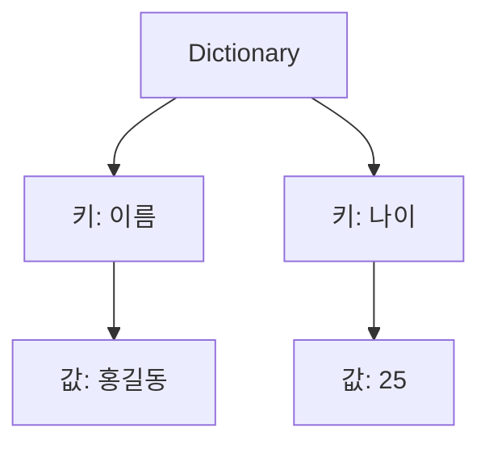

# 186 Python의 딕셔너리(Dictionary)

작성 기준일: 2026-06-01
검색/보강일: 2026-06-01
PDF 확인 위치: 28페이지, 4과목 프로그래밍 언어 활용, 186 Python의 딕셔너리(Dictionary)

## 한 줄 요약

- Python 딕셔너리는 사용자가 지정한 키로 값을 저장하고 접근하는 key-value 구조의 자료형이다.



## 한눈에 보는 구조

| 구분 | 내용 |
|---|---|
| 구조 | 키-값 쌍 |
| 접근 | `딕셔너리[키]` |
| 생성 | `{키: 값}`, `dict()` |
| 용도 | 연관된 값을 묶어서 저장 |

## PDF 기준 핵심

- 딕셔너리는 연관된 값을 묶어서 저장하는 용도로 사용한다.
- 리스트는 위치값인 0, 1, 2 등을 키처럼 사용하지만, 딕셔너리는 사용자가 원하는 키를 직접 지정한다.
- 딕셔너리에 접근할 때는 대괄호 `[]` 안에 키를 지정한다.
- 예:
  - `a = {'이름':'홍길동', '나이':25, '주소':'서울'}`
  - `a['이름'] = '이순신'`

## 개념 설명

- Python 공식 자료구조 문서는 dictionary를 key:value 쌍의 모음으로 설명한다.
- 리스트가 위치 인덱스로 접근한다면 딕셔너리는 키로 접근한다.
- 키는 중복될 수 없고, 같은 키에 새 값을 넣으면 기존 값이 바뀐다.

## 시험 포인트

- 딕셔너리는 키-값 구조이다.
- 사용자가 키를 직접 지정한다.
- 접근은 `a['키']` 형태이다.
- 값 변경은 `a['키'] = 새값` 형태이다.
- 리스트의 위치 인덱스와 딕셔너리의 키를 구분한다.

## 헷갈리는 비교

| 비교 | 리스트 | 딕셔너리 |
|---|---|---|
| 접근 기준 | 위치 인덱스 | 키 |
| 표기 | `[값1, 값2]` | `{키: 값}` |
| 예 | `a[0]` | `a['이름']` |

## 예시 또는 암기 포인트

```python
a = {'이름': '홍길동', '나이': 25, '주소': '서울'}
a['이름'] = '이순신'
```

- 암기 문장: `딕셔너리는 키로 찾는 사전`

## 빠른 복습

- 딕셔너리는 Dictionary이다.
- 키-값 쌍으로 저장한다.
- 사용자가 키를 직접 지정한다.
- 대괄호 안에 키를 넣어 접근한다.
- 리스트는 인덱스, 딕셔너리는 키이다.

## 참고 링크

- [Python Tutorial - Dictionaries](https://docs.python.org/3/tutorial/datastructures.html#dictionaries)
- [Python Documentation - Mapping Types: dict](https://docs.python.org/3/library/stdtypes.html#mapping-types-dict)

