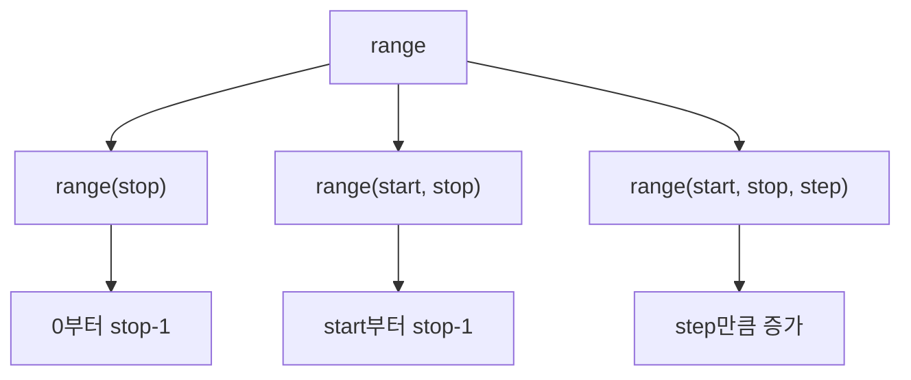

# 187 Python의 Range

작성 기준일: 2026-06-01
검색/보강일: 2026-06-01
PDF 확인 위치: 28페이지, 4과목 프로그래밍 언어 활용, 187 Python의 Range

## 한 줄 요약

- Python의 `range`는 시작값, 끝값, 증가값 규칙에 따라 연속된 숫자를 생성하는 시퀀스 자료형이다.



## 한눈에 보는 구조

| 표현 | 생성 범위 |
|---|---|
| `range(5)` | 0, 1, 2, 3, 4 |
| `range(4, 9)` | 4, 5, 6, 7, 8 |
| `range(1, 15, 3)` | 1, 4, 7, 10, 13 |

## PDF 기준 핵심

- range는 연속된 숫자를 생성하는 것으로, 리스트, 반복문 등에서 많이 사용된다.
- `list(range(5))`는 0에서 4까지 저장한다.
- `list(range(4, 9))`는 4에서 8까지 저장한다.
- `list(range(1, 15, 3))`은 1에서 14까지 3씩 증가하는 숫자를 저장한다.

## 개념 설명

- Python 공식 문서는 range가 start, stop, step 값을 저장하고 필요할 때 항목을 계산한다고 설명한다.
- stop 값은 포함하지 않는다.
- 반복문에서 `for i in range(...)` 형태로 자주 사용한다.

## 시험 포인트

- `range(5)`는 5를 포함하지 않는다.
- 기본 시작값은 0이다.
- `range(start, stop)`은 stop 직전까지 생성한다.
- 세 번째 인수는 증가값 step이다.
- list로 감싸면 실제 목록처럼 볼 수 있다.

## 헷갈리는 비교

| 표현 | 포함 여부 |
|---|---|
| `range(5)` | 0,1,2,3,4 포함, 5 제외 |
| `range(4,9)` | 4 포함, 9 제외 |
| `range(1,15,3)` | 15 미만까지 3씩 증가 |

## 예시 또는 암기 포인트

```python
list(range(1, 15, 3))
```

- 결과: `[1, 4, 7, 10, 13]`
- 암기 문장: `range의 stop은 멈춤선, 포함하지 않음`

## 빠른 복습

- range는 연속된 숫자를 생성한다.
- stop 값은 포함하지 않는다.
- 기본 시작값은 0이다.
- step은 증가 간격이다.
- 리스트와 반복문에서 자주 사용한다.

## 참고 링크

- [Python Documentation - range](https://docs.python.org/3/library/stdtypes.html#range)
