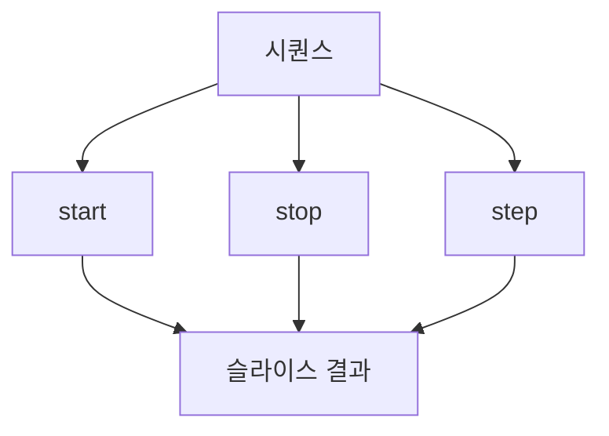

# 188 Python의 슬라이스

작성 기준일: 2026-06-01
검색/보강일: 2026-06-01
PDF 확인 위치: 28페이지, 4과목 프로그래밍 언어 활용, 188 Python의 슬라이스

## 한 줄 요약

- Python 슬라이스는 문자열이나 리스트 같은 순차형 객체에서 `[start:stop:step]` 형태로 일부 구간을 잘라 반환하는 기능이다.



## 한눈에 보는 구조

| 표현 | 의미 |
|---|---|
| `a[1:3]` | 1번 이상 3번 미만 |
| `a[0:5:2]` | 0번부터 5번 미만까지 2칸씩 |
| `a[3:]` | 3번부터 끝까지 |
| `a[:3]` | 처음부터 3번 미만까지 |
| `a[::3]` | 전체에서 3칸씩 |

## PDF 기준 핵심

- 슬라이스는 문자열이나 리스트와 같은 순차형 객체에서 일부를 잘라 반환하는 기능이다.
- PDF 예:
  - `a[1:3]` → `['b', 'c']`
  - `a[0:5:2]` → `['a', 'c', 'e']`
  - `a[3:]` → `['d', 'e']`
  - `a[:3]` → `['a', 'b', 'c']`
  - `a[::3]` → `['a', 'd']`

## 개념 설명

- Python sequence type은 인덱싱과 슬라이싱을 지원한다.
- 슬라이스의 stop 인덱스는 포함하지 않는다.
- start를 생략하면 처음부터, stop을 생략하면 끝까지, step을 생략하면 1칸씩 이동한다.

## 시험 포인트

- 슬라이스는 `[start:stop:step]`이다.
- stop은 포함하지 않는다.
- start 생략은 처음부터이다.
- stop 생략은 끝까지이다.
- step은 건너뛰는 간격이다.

## 헷갈리는 비교

| 표현 | 결과 기준 |
|---|---|
| `a[1:3]` | 1, 2번 인덱스 |
| `a[:3]` | 0, 1, 2번 인덱스 |
| `a[3:]` | 3번부터 끝까지 |
| `a[::3]` | 처음부터 3칸 간격 |

## 예시 또는 암기 포인트

```python
a = ['a', 'b', 'c', 'd', 'e']
print(a[0:5:2])
```

- 결과: `['a', 'c', 'e']`
- 암기 문장: `슬라이스의 끝 인덱스는 포함하지 않는다`

## 빠른 복습

- 슬라이스는 순차형 객체 일부를 잘라 반환한다.
- 형식은 `[start:stop:step]`이다.
- stop은 제외된다.
- start, stop, step은 생략할 수 있다.
- 리스트와 문자열에서 자주 사용한다.

## 참고 링크

- [Python Documentation - Sequence Types](https://docs.python.org/3/library/stdtypes.html#sequence-types-list-tuple-range)
