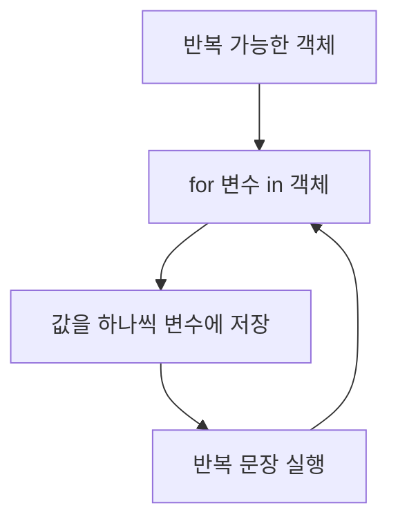

# 189 Python의 for문

작성 기준일: 2026-06-01
검색/보강일: 2026-06-01
PDF 확인 위치: 28페이지, 4과목 프로그래밍 언어 활용, 189 Python의 for문

## 한 줄 요약

- Python의 for문은 `range`나 리스트 같은 반복 가능한 객체의 값을 하나씩 변수에 저장하며 반복 수행한다.



## 한눈에 보는 구조

| 방식 | 예 | 의미 |
|---|---|---|
| range 이용 | `for i in range(1, 11):` | 1부터 10까지 반복 |
| 리스트 이용 | `for i in a:` | 리스트 요소를 순서대로 반복 |

## PDF 기준 핵심

- `range`를 이용하는 방식:

```python
for i in range(1, 11):
    sum = sum + i
```

- 리스트를 이용하는 방식:

```python
a = [1, 2, 3, 4, 5, 6, 7, 8, 9, 10]
for i in a:
    sum = sum + i
```

## 개념 설명

- Python 공식 문서는 for문이 시퀀스나 반복 가능한 객체의 항목을 순서대로 반복한다고 설명한다.
- `range(1, 11)`은 1부터 10까지 생성한다.
- 리스트를 대상으로 하면 리스트의 요소가 차례대로 변수에 들어간다.

## 시험 포인트

- Python for문은 `for 변수 in 반복대상:` 형태이다.
- `range(1, 11)`은 11을 포함하지 않는다.
- 들여쓰기된 문장이 반복된다.
- 리스트를 쓰면 요소를 순서대로 꺼낸다.

## 헷갈리는 비교

| 비교 | C/Java for | Python for |
|---|---|---|
| 형태 | 초기값·조건·증가값 | 반복 가능한 객체 순회 |
| 예 | `for(i=0; i<10; i++)` | `for i in range(10):` |

## 예시 또는 암기 포인트

- `range(1, 11)`은 1부터 10까지이다.
- 암기 문장: `Python for는 in 뒤를 하나씩 꺼낸다`

## 빠른 복습

- Python for문은 반복 가능한 객체를 순회한다.
- range와 리스트를 자주 사용한다.
- 콜론과 들여쓰기가 중요하다.
- stop 값은 포함하지 않는다.

## 참고 링크

- [Python Tutorial - for Statements](https://docs.python.org/3/tutorial/controlflow.html#for-statements)
- [Python Documentation - range](https://docs.python.org/3/library/stdtypes.html#range)

<!-- study-links:start -->
## 관련 문서

- `for문`: [[정보처리기사/4과목 프로그래밍 언어 활용/174 for문/174 for문|174 for문]]
<!-- study-links:end -->
