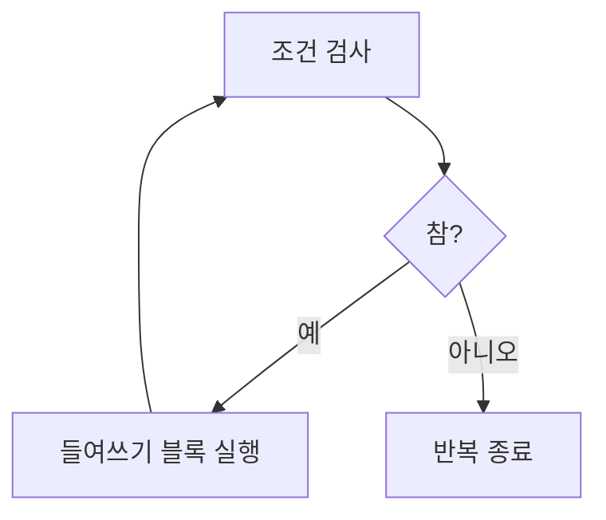

# 190 Python의 while문

작성 기준일: 2026-06-01
검색/보강일: 2026-06-01
PDF 확인 위치: 29페이지, 4과목 프로그래밍 언어 활용, 190 Python의 while문

## 한 줄 요약

- Python의 while문은 조건이 참인 동안 들여쓰기된 실행문을 반복 수행하는 조건 중심 반복문이다.



## 한눈에 보는 구조

| 구분 | 내용 |
|---|---|
| 형태 | `while 조건:` |
| 반복 기준 | 조건식 |
| 실행 범위 | 들여쓰기 블록 |
| 종료 | 조건이 거짓이 될 때 |

## PDF 기준 핵심

- PDF 예:

```python
while i <= 10:
    i = i + 1
```

- `i`가 10보다 작거나 같은 동안 `i` 값을 1씩 누적시킨다.

## 개념 설명

- Python의 while문은 조건식이 참인 동안 반복한다.
- 조건이 처음부터 거짓이면 반복 블록은 실행되지 않는다.
- 반복 안에서 조건을 바꾸지 않으면 무한 반복이 될 수 있다.

## 시험 포인트

- `while 조건:` 뒤에 콜론이 온다.
- 반복할 문장은 들여쓰기한다.
- 조건이 참인 동안 반복한다.
- 조건을 변화시키는 문장이 없으면 끝나지 않을 수 있다.

## 헷갈리는 비교

| 비교 | for | while |
|---|---|---|
| 기준 | 반복 대상 순회 | 조건이 참인지 |
| 적합 | 횟수나 대상이 명확 | 조건이 바뀔 때까지 반복 |

## 예시 또는 암기 포인트

```python
i = 1
while i <= 10:
    i = i + 1
```

- 암기 문장: `while은 조건이 참일 동안`

## 빠른 복습

- Python while문은 조건 반복문이다.
- 조건이 참이면 반복한다.
- 들여쓰기 블록이 실행 범위이다.
- 조건 변화가 필요하다.

## 참고 링크

- [Python Reference - while statement](https://docs.python.org/3/reference/compound_stmts.html#the-while-statement)

