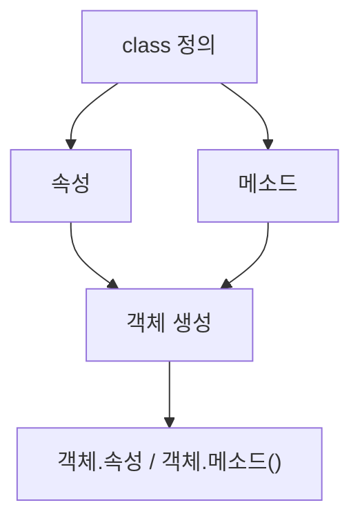

# 191 Python의 클래스

작성 기준일: 2026-06-01
검색/보강일: 2026-06-01
PDF 확인 위치: 29페이지, 4과목 프로그래밍 언어 활용, 191 Python의 클래스

## 한 줄 요약

- Python 클래스는 속성과 메소드를 정의한 뒤 객체를 생성해 사용하는 객체지향 프로그래밍의 기본 단위이다.



## 한눈에 보는 구조

| 구성 | 의미 |
|---|---|
| class | 클래스 정의 |
| 속성 | 객체가 가지는 값 |
| 메소드 | 클래스 안에 정의된 함수 |
| 객체 | 클래스로부터 생성된 인스턴스 |
| self | 객체 자신을 가리키는 첫 번째 매개변수 관례 |

## PDF 기준 핵심

- 클래스를 사용하려면 클래스 이름을 정한다.
- 객체 생성을 위한 속성과 메소드, 즉 함수를 정의한다.
- 객체를 선언하면 된다.
- PDF 예제는 `Cls` 클래스로 객체 `a`를 만들고, `a.x = 5`를 저장한 뒤 `a.add(5)` 결과인 10을 출력한다.

## 개념 설명

- Python 공식 문서는 class가 새로운 namespace를 만들고 클래스 객체를 생성한다고 설명한다.
- 메소드의 첫 번째 매개변수로 관례상 `self`를 사용한다.
- `self.x`는 해당 객체의 속성에 접근한다.

## 시험 포인트

- 클래스는 속성과 메소드를 묶는다.
- 객체를 생성해 사용한다.
- `self`는 객체 자신을 가리키는 관례적 이름이다.
- `a.x = 5`는 객체 a의 속성 x에 값을 저장한다.
- `a.add(5)`는 객체 a의 메소드를 호출한다.

## 헷갈리는 비교

| 비교 | 클래스 | 객체 |
|---|---|---|
| 의미 | 설계도 | 실제 생성된 대상 |
| 예 | `class Cls:` | `a = Cls()` |

## 예시 또는 암기 포인트

```python
class Cls:
    x = 10
    def add(self, a):
        return a + self.x
```

- 암기 문장: `class는 틀, object는 만든 것`

## 빠른 복습

- Python 클래스는 `class`로 정의한다.
- 속성과 메소드를 가진다.
- 객체를 생성해 사용한다.
- 메소드 첫 번째 매개변수는 보통 `self`이다.

## 참고 링크

- [Python Tutorial - Classes](https://docs.python.org/3/tutorial/classes.html)

