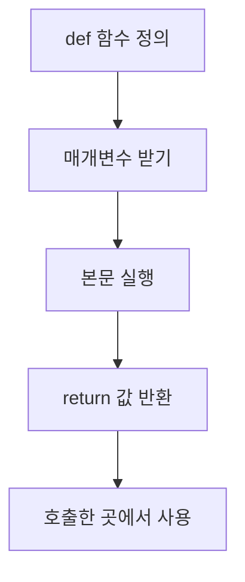

# 192 Python의 클래스 없는 메소드

작성 기준일: 2026-06-01
검색/보강일: 2026-06-01
PDF 확인 위치: 29페이지, 4과목 프로그래밍 언어 활용, 192 Python의 클래스 없는 메소드

## 한 줄 요약

- Python에서는 C언어의 사용자 정의 함수처럼 클래스 없이 `def`로 함수만 단독 정의해 호출할 수 있다.



## 한눈에 보는 구조

| 구분 | 내용 |
|---|---|
| 정의 키워드 | `def` |
| 클래스 필요 | 필요 없음 |
| 인수 전달 | 호출 시 매개변수에 전달 |
| 반환 | `return` |

## PDF 기준 핵심

- C언어의 사용자 정의 함수와 같이 클래스 없이 메소드만 단독으로 사용할 수 있다.
- PDF 예제에서 `calc(x, y)`는 x와 y를 받아 `x *= y` 후 x를 반환한다.
- `a, b = 3, 4`, `a = calc(a, b)` 후 출력 결과는 `12, 4`이다.

## 개념 설명

- Python 공식 문서는 `def`가 함수 정의를 시작한다고 설명한다.
- 함수 호출 시 인수 값이 매개변수에 전달된다.
- 숫자 값은 함수 내부에서 새 이름에 바인딩되므로 예제에서 `b`는 바뀌지 않는다.

## 시험 포인트

- 클래스 없이 `def`로 함수를 만들 수 있다.
- `return` 값이 호출한 위치로 돌아간다.
- 예제에서 `a`는 12가 되지만 `b`는 4 그대로이다.
- 함수 내부 변수 변화와 외부 변수 값을 구분한다.

## 헷갈리는 비교

| 비교 | 클래스 메소드 | 클래스 없는 함수 |
|---|---|---|
| 정의 위치 | class 내부 | 단독 |
| 첫 매개변수 | 보통 self | 일반 매개변수 |
| 호출 | 객체.메소드() | 함수명() |

## 예시 또는 암기 포인트

```python
def calc(x, y):
    x *= y
    return x
```

- 암기 문장: `def는 단독 함수도 만든다`

## 빠른 복습

- Python 함수는 `def`로 정의한다.
- 클래스 없이 단독 사용 가능하다.
- `return`으로 결과를 반환한다.
- 인수 전달과 반환값 저장 순서를 따라가야 한다.

## 참고 링크

- [Python Tutorial - Defining Functions](https://docs.python.org/3/tutorial/controlflow.html#defining-functions)

<!-- study-links:start -->
## 관련 문서

- `python의 클래스`: [[정보처리기사/4과목 프로그래밍 언어 활용/191 Python의 클래스/191 Python의 클래스|191 Python의 클래스]]
<!-- study-links:end -->
