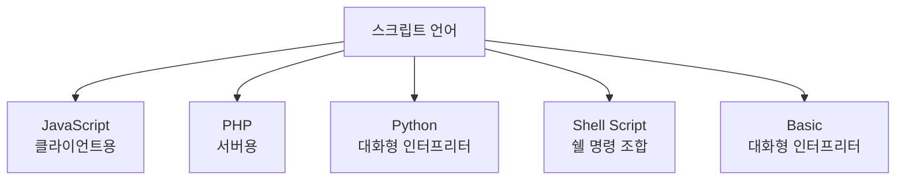

# 193 스크립트 언어의 종류

작성 기준일: 2026-06-01
검색/보강일: 2026-06-01
PDF 확인 위치: 29페이지, 4과목 프로그래밍 언어 활용, 193 스크립트 언어의 종류

## 한 줄 요약

- 스크립트 언어는 인터프리터 방식으로 실행되는 경우가 많은 언어이며, 시험 PDF는 JavaScript, PHP, Python, Shell Script, Basic을 대표 예로 제시한다.

## 한눈에 보는 구조

| 언어 | PDF 기준 핵심 |
|---|---|
| JavaScript | 웹 페이지 동작 제어에 사용되는 클라이언트용 스크립트 언어 |
| PHP | Linux, Unix, Windows에서 사용 가능한 서버용 스크립트 언어 |
| Python | 귀도 반 로섬이 발표한 대화형 인터프리터 언어 |
| Shell Script | 쉘 명령어 조합으로 구성 |
| Basic | 절차지향 기능을 지원하는 대화형 인터프리터 언어 |

## PDF 기준 핵심

- 자바스크립트는 웹 페이지 동작을 제어하는 데 사용되는 클라이언트용 스크립트 언어이다.
- PHP는 Linux, Unix, Windows 운영체제에서 사용 가능한 서버용 스크립트 언어이다.
- Python은 귀도 반 로섬이 발표한 대화형 인터프리터 언어이다.
- 쉘 스크립트는 쉘에서 사용되는 명령어들의 조합으로 구성된 스크립트 언어이다.
- Basic은 절차지향 기능을 지원하는 대화형 인터프리터 언어이다.

## 개념 설명

- MDN은 JavaScript를 웹 페이지의 스크립트 언어로 널리 알려진 경량 인터프리터 언어라고 설명한다.
- MDN PHP 용어 설명은 PHP를 HTML에 포함될 수 있는 오픈소스 서버 측 스크립트 언어로 설명한다.
- Bash 공식 문서는 쉘이 명령 해석기이면서 프로그래밍 언어 기능을 제공한다고 설명한다.

## 시험 포인트

- JavaScript는 클라이언트용 웹 동작 제어 단서이다.
- PHP는 서버용 스크립트 언어이다.
- Python은 귀도 반 로섬과 대화형 인터프리터 단서이다.
- Shell Script는 쉘 명령어 조합이다.
- Basic은 대화형 인터프리터와 절차지향 기능 단서이다.

## 헷갈리는 비교

| 비교 | JavaScript | PHP |
|---|---|---|
| 중심 | 클라이언트 웹 동작 | 서버 측 웹 처리 |
| 실행 위치 | 브라우저 중심 | 서버 중심 |

## 예시 또는 암기 포인트

- 암기 문장: `JS는 클라이언트, PHP는 서버, Python은 귀도`

## 빠른 복습

- 스크립트 언어 종류는 JavaScript, PHP, Python, Shell Script, Basic이다.
- JavaScript는 웹 페이지 동작 제어이다.
- PHP는 서버용이다.
- Python은 대화형 인터프리터이다.
- Shell Script는 쉘 명령어 조합이다.

## 참고 링크

- [MDN - JavaScript](https://developer.mozilla.org/en-US/docs/Web/JavaScript)
- [MDN - PHP](https://developer.mozilla.org/en-US/docs/Glossary/PHP)
- [GNU Bash Reference Manual](https://www.gnu.org/software/bash/manual/bash.html)

<!-- study-links:start -->
## 관련 문서

- `unix`: [[정보처리기사/4과목 프로그래밍 언어 활용/197 UNIX의 특징/197 UNIX의 특징|197 UNIX의 특징]]
- `php`: [[php-scope-resolution-operator/php-scope-resolution-operator|PHP `::` 스코프 결정 연산자 상세 노트]]
<!-- study-links:end -->
