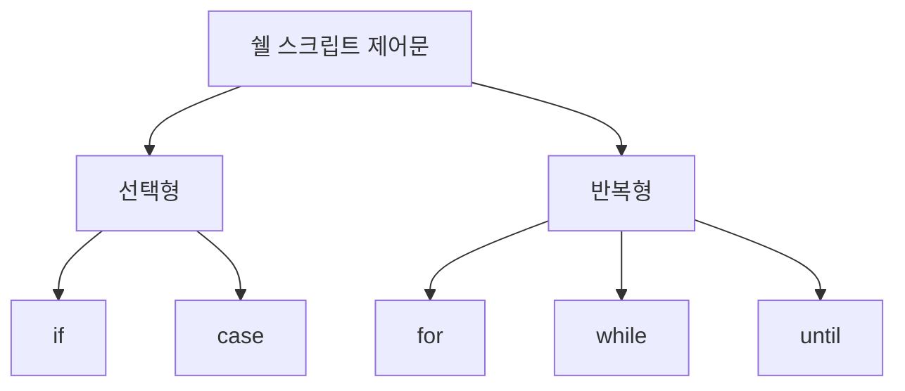

# 194 쉘 스크립트에서 사용되는 제어문

작성 기준일: 2026-06-01
검색/보강일: 2026-06-01
PDF 확인 위치: 30페이지, 4과목 프로그래밍 언어 활용, 194 쉘 스크립트에서 사용되는 제어문

## 한 줄 요약

- 쉘 스크립트 제어문은 선택형 `if`, `case`와 반복형 `for`, `while`, `until`로 구분한다.

## 한눈에 보는 구조

| 구분 | 제어문 |
|---|---|
| 선택형 | if, case |
| 반복형 | for, while, until |

## PDF 기준 핵심

- 선택형 제어문: `if`, `case`
- 반복형 제어문: `for`, `while`, `until`

## 개념 설명

- Bash 공식 매뉴얼은 shell이 flow control constructs를 제공한다고 설명한다.
- Bash의 looping constructs에는 `for`, `while`, `until`이 포함된다.
- `if`와 `case`는 조건에 따라 실행 경로를 선택할 때 사용한다.

## 시험 포인트

- 선택형은 if, case이다.
- 반복형은 for, while, until이다.
- until은 조건이 거짓인 동안 반복하는 형태로 while과 대비된다.
- 쉘 스크립트 제어문은 C/Java 문법과 세부 표기가 다르지만 역할은 유사하다.

## 헷갈리는 비교

| 비교 | if | case |
|---|---|---|
| 용도 | 조건 판정 | 여러 패턴 중 선택 |

| 비교 | while | until |
|---|---|---|
| 반복 조건 | 조건이 참인 동안 | 조건이 거짓인 동안 |

## 예시 또는 암기 포인트

- 암기 문장: `선택은 if/case, 반복은 for/while/until`

## 빠른 복습

- 쉘 제어문은 선택형과 반복형으로 나눈다.
- 선택형은 if, case이다.
- 반복형은 for, while, until이다.
- Bash 매뉴얼 기준으로도 반복 구조가 제공된다.

## 참고 링크

- [GNU Bash Manual - Looping Constructs](https://www.gnu.org/software/bash/manual/html_node/Looping-Constructs)
- [GNU Bash Reference Manual](https://www.gnu.org/software/bash/manual/bash.html)
