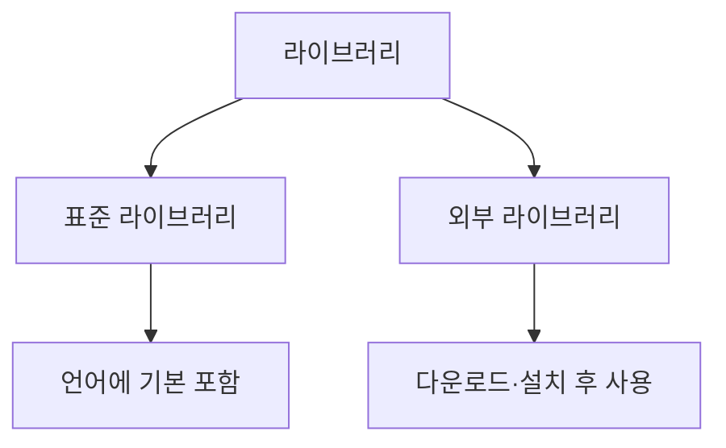

# 195 라이브러리

작성 기준일: 2026-06-01
검색/보강일: 2026-06-01
PDF 확인 위치: 30페이지, 4과목 프로그래밍 언어 활용, 195 라이브러리

## 한 줄 요약

- 라이브러리는 자주 쓰는 기능을 모듈이나 패키지로 묶어 재사용하게 하는 코드 집합이며, 표준 라이브러리와 외부 라이브러리로 구분한다.

## 한눈에 보는 구조

| 종류 | 의미 |
|---|---|
| 표준 라이브러리 | 언어에 기본적으로 포함된 라이브러리 |
| 외부 라이브러리 | 개발자들이 공유한 기능을 설치해 사용하는 라이브러리 |

## PDF 기준 핵심

- 표준 라이브러리는 프로그래밍 언어에 기본적으로 포함되어 있는 라이브러리이다.
- 표준 라이브러리는 여러 종류의 모듈이나 패키지로 구성된다.
- 외부 라이브러리는 개발자들이 필요한 기능들을 만들어 인터넷 등에 공유해 놓은 것이다.
- 외부 라이브러리는 다운로드해 설치한 후 사용한다.

## 개념 설명

- Python 공식 문서는 풍부한 표준 라이브러리를 제공한다.
- C도 `stdio.h`, `stdlib.h`, `string.h` 같은 표준 헤더와 라이브러리 기능을 제공한다.
- 외부 라이브러리는 패키지 관리자나 다운로드를 통해 추가한다.

## 시험 포인트

- 표준 라이브러리는 언어에 기본 포함된다.
- 외부 라이브러리는 설치 후 사용한다.
- 모듈, 패키지 단서가 표준 라이브러리 설명에 나온다.
- 외부 라이브러리는 인터넷 공유, 다운로드 단서와 연결한다.

## 헷갈리는 비교

| 비교 | 표준 라이브러리 | 외부 라이브러리 |
|---|---|---|
| 포함 여부 | 기본 포함 | 별도 설치 |
| 제공 주체 | 언어/플랫폼 | 외부 개발자·커뮤니티 |
| 예 | Python 표준 라이브러리 | PyPI 패키지 |

## 예시 또는 암기 포인트

- 표준: Python의 `math`, C의 `stdlib.h`
- 외부: 웹 프레임워크, 데이터 분석 패키지 등
- 암기 문장: `표준은 기본 포함, 외부는 설치`

## 빠른 복습

- 라이브러리는 재사용 기능 묶음이다.
- 표준 라이브러리는 기본 포함이다.
- 외부 라이브러리는 설치 후 사용한다.
- 모듈과 패키지로 구성될 수 있다.

## 참고 링크

- [Python Documentation - The Python Standard Library](https://docs.python.org/3/library/)
- [cppreference - C standard library headers](https://en.cppreference.com/w/c/header)
