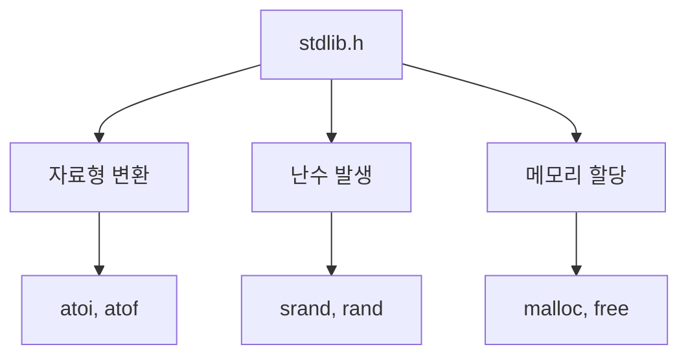

# 196 C언어의 stdlib.h

작성 기준일: 2026-06-01
검색/보강일: 2026-06-01
PDF 확인 위치: 30페이지, 4과목 프로그래밍 언어 활용, 196 C언어의 stdlib.h

## 한 줄 요약

- C언어의 `stdlib.h`는 자료형 변환, 난수 발생, 메모리 할당 등 범용 유틸리티 함수를 제공하는 표준 라이브러리 헤더이다.

## 한눈에 보는 구조

| 기능 | 주요 함수 |
|---|---|
| 자료형 변환 | `atoi`, `atof` |
| 난수 발생 | `srand`, `rand` |
| 메모리 할당/해제 | `malloc`, `free` |

## PDF 기준 핵심

- `stdlib.h`는 자료형 변환, 난수 발생, 메모리 할당에 사용되는 기능들을 제공한다.
- 주요 함수는 `atoi`, `atof`, `srand`, `rand`, `malloc`, `free` 등이다.

## 개념 설명

- cppreference는 `stdlib.h`가 프로그램 종료, 메모리 관리, 문자열 변환, 난수 생성 등의 유틸리티 기능을 제공한다고 설명한다.
- `atoi`는 문자열을 정수로 변환한다.
- `atof`는 문자열을 부동소수점 수로 변환한다.
- `rand`는 난수를 생성하고, `srand`는 난수 생성기의 seed를 설정한다.
- `malloc`은 동적 메모리를 할당하고, `free`는 할당된 메모리를 해제한다.

## 시험 포인트

- `stdlib.h`는 표준 라이브러리 헤더이다.
- `atoi`, `atof`는 자료형 변환이다.
- `srand`, `rand`는 난수와 연결한다.
- `malloc`, `free`는 메모리 할당과 해제이다.

## 헷갈리는 비교

| 함수 | 역할 |
|---|---|
| `atoi` | 문자열 → 정수 |
| `atof` | 문자열 → 실수 |
| `rand` | 난수 생성 |
| `srand` | 난수 seed 설정 |
| `malloc` | 메모리 할당 |
| `free` | 메모리 해제 |

## 예시 또는 암기 포인트

- 암기 묶음: `변환 atoi/atof`, `난수 srand/rand`, `메모리 malloc/free`

## 빠른 복습

- `stdlib.h`는 C 표준 라이브러리 헤더이다.
- 자료형 변환, 난수 발생, 메모리 할당 기능을 제공한다.
- 주요 함수 목록을 기능별로 외운다.

## 참고 링크

- [cppreference - C stdlib.h](https://en.cppreference.com/w/c/header/stdlib.html)

