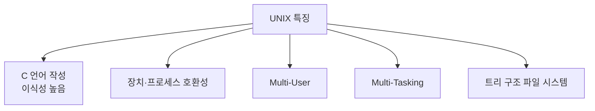

# 197 UNIX의 특징

작성 기준일: 2026-06-01
검색/보강일: 2026-06-01
PDF 확인 위치: 30페이지, 4과목 프로그래밍 언어 활용, 197 UNIX의 특징

## 한 줄 요약

- UNIX는 C 언어 기반으로 이식성이 높고, 다중 사용자·다중 작업과 트리 구조 파일 시스템을 지원하는 운영체제 계열이다.

## 한눈에 보는 구조

| 특징 | 의미 |
|---|---|
| C 언어 작성 | 이식성 높음 |
| 장치·프로세스 호환성 | 여러 환경에서 호환성 확보 |
| 다중 사용자 | 여러 사용자가 동시에 사용 |
| 다중 작업 | 여러 작업 동시 처리 |
| 트리 구조 파일 시스템 | 계층적 파일 관리 |

## PDF 기준 핵심

- 대부분 C 언어로 작성되어 있어 이식성이 높다.
- 장치와 프로세스 간의 호환성이 높다.
- 다중 사용자(Multi-User), 다중 작업(Multi-Tasking)을 지원한다.
- 트리 구조의 파일 시스템을 갖는다.

## 개념 설명

- The Open Group은 UNIX를 표준으로 관리하며, UNIX 계열 시스템은 운영체제 표준과 호환성의 관점에서 다뤄진다.
- 전통적으로 UNIX는 작은 도구, 계층적 파일 시스템, 쉘 인터페이스, 멀티유저 환경과 연결된다.
- 시험에서는 역사보다 특징 목록을 정확히 외우는 것이 중요하다.

## 시험 포인트

- C 언어 작성과 이식성을 연결한다.
- Multi-User, Multi-Tasking을 외운다.
- 트리 구조 파일 시스템을 기억한다.
- 커널과 쉘은 다음 항목과 연결된다.

## 헷갈리는 비교

| 비교 | 커널 | 쉘 |
|---|---|---|
| 위치 | 운영체제 핵심 | 사용자 명령 해석기 |
| 역할 | 자원 관리 | 명령 해석 및 실행 요청 |

## 예시 또는 암기 포인트

- 암기 문장: `C로 작성, 다중 사용자·다중 작업, 트리 파일`

## 빠른 복습

- UNIX는 이식성이 높다.
- 다중 사용자와 다중 작업을 지원한다.
- 트리 구조 파일 시스템을 가진다.
- 장치와 프로세스 호환성이 높다.

## 참고 링크

- [UNIX - The Open Group Standard](https://www.unix.org/)
- [GNU Bash Reference Manual](https://www.gnu.org/software/bash/manual/bash.html)

<!-- study-links:start -->
## 관련 문서

- `unix`: [[정보처리기사/4과목 프로그래밍 언어 활용/198 UNIX - 커널(Kernel)의 기능/198 UNIX - 커널(Kernel)의 기능|198 UNIX - 커널(Kernel)의 기능]]
<!-- study-links:end -->
