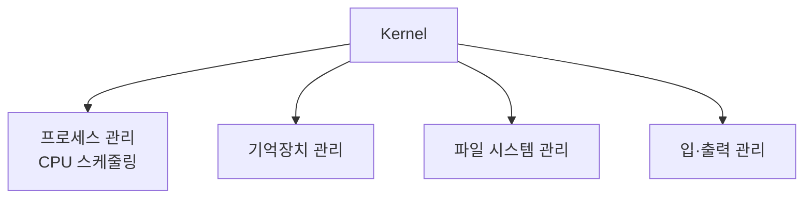

# 198 UNIX - 커널(Kernel)의 기능

작성 기준일: 2026-06-01
검색/보강일: 2026-06-01
PDF 확인 위치: 30페이지, 4과목 프로그래밍 언어 활용, 198 UNIX - 커널(Kernel)의 기능

## 한 줄 요약

- UNIX 커널은 운영체제의 핵심으로 프로세스, 기억장치, 파일 시스템, 입·출력 같은 시스템 자원을 관리한다.

## 한눈에 보는 구조

| 기능 | 의미 |
|---|---|
| 프로세스 관리 | CPU 스케줄링, 실행 흐름 관리 |
| 기억장치 관리 | 메모리 할당과 보호 |
| 파일 시스템 관리 | 파일과 디렉터리 관리 |
| 입·출력 관리 | 장치와 데이터 입출력 관리 |

## PDF 기준 핵심

- UNIX 커널의 기능:
  - 프로세스(CPU 스케줄링) 관리
  - 기억장치 관리
  - 파일 시스템 관리
  - 입·출력 관리

## 개념 설명

- 커널은 하드웨어와 사용자 프로그램 사이에서 핵심 자원을 관리한다.
- Linux Kernel 공식 문서는 scheduler, memory management, filesystems, input 등 하위 시스템 문서를 제공한다.
- 시험에서는 세부 구현보다 PDF의 네 가지 관리 기능을 그대로 외우는 것이 중요하다.

## 시험 포인트

- 커널은 운영체제 핵심이다.
- 프로세스 관리는 CPU 스케줄링과 연결된다.
- 기억장치 관리는 메모리 관리이다.
- 파일 시스템 관리와 입·출력 관리를 함께 외운다.
- 쉘은 명령어 해석기이므로 커널과 구분한다.

## 헷갈리는 비교

| 비교 | 커널 | 쉘 |
|---|---|---|
| 핵심 역할 | 시스템 자원 관리 | 사용자 명령 해석 |
| 위치 | 운영체제 핵심 | 사용자 인터페이스 |
| 예 | 스케줄링, 메모리 관리 | 명령 실행 요청 |

## 예시 또는 암기 포인트

- 암기 문장: `커널은 프로세스·메모리·파일·입출력 관리`

## 빠른 복습

- 커널은 Kernel이다.
- 프로세스 관리와 CPU 스케줄링을 담당한다.
- 기억장치와 파일 시스템을 관리한다.
- 입·출력 관리도 담당한다.
- 쉘과 역할을 구분한다.

## 참고 링크

- [Linux Kernel Documentation - Scheduler](https://www.kernel.org/doc/html/latest/scheduler/)
- [Linux Kernel Documentation - Memory Management](https://www.kernel.org/doc/html/latest/mm/index.html)
- [Linux Kernel Documentation - Filesystems](https://www.kernel.org/doc/html/latest/filesystems/index.html)

<!-- study-links:start -->
## 관련 문서

- `unix`: [[정보처리기사/4과목 프로그래밍 언어 활용/197 UNIX의 특징/197 UNIX의 특징|197 UNIX의 특징]]
- `스케줄링`: [[정보처리기사/4과목 프로그래밍 언어 활용/204 스케줄링 - SJF/204 스케줄링 - SJF|204 스케줄링 - SJF]]
<!-- study-links:end -->
