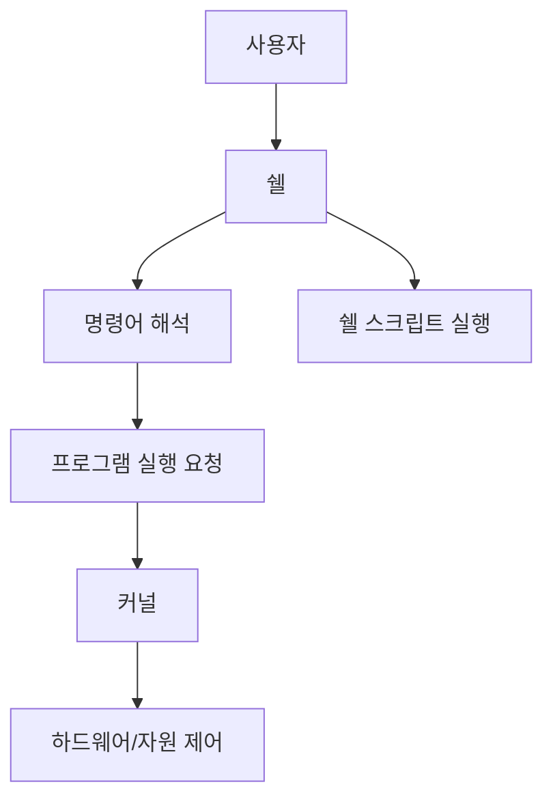

# 199 UNIX - 쉘(Shell)

작성 기준일: 2026-06-01
검색/보강일: 2026-06-01
기준 PDF: `/Users/nes0903/Documents/study/정보처리기사/핵심요약집_2026_정보처리기사필기핵심요약.pdf`
PDF 확인 위치: 30페이지 `199 UNIX - 쉘(Shell)`

## 한 줄 요약

- UNIX 쉘은 사용자의 명령을 해석해 커널이 실행할 프로그램을 호출하는 명령어 해석기이자 사용자 인터페이스이다.

## 한눈에 보는 구조

## PDF 기준 핵심

- 사용자의 명령어를 인식하여 프로그램을 호출하고 명령을 수행하는 명령어 해석기이다.
- 시스템과 사용자 간의 인터페이스를 담당한다.
- `UNIX - 커널`이 자원 관리의 핵심이면, `쉘`은 사용자가 그 기능을 명령 형태로 이용하게 해 주는 접점이다.

## 개념 설명

- 쉘은 사용자가 입력한 문자열을 읽고, 명령 이름과 인수, 리다이렉션, 파이프, 변수 치환 등을 해석한다.
- 해석 결과가 외부 명령이면 실행 파일을 찾아 새 프로세스로 실행하고, 내부 명령이면 쉘 프로세스 안에서 직접 처리한다.
- 대표 쉘에는 Bourne shell 계열의 `sh`, `bash`, `ksh`, `zsh`와 C shell 계열의 `csh` 등이 있다.
- Bash 문서에서는 Bash를 GNU 운영체제의 쉘이자 명령 언어 해석기로 설명하며, POSIX 표준 쉘의 규칙을 상당 부분 따른다.

## 시험 포인트

- `쉘 = 명령어 해석기 + 사용자 인터페이스`로 외운다.
- 커널과 쉘을 구분하는 문제가 자주 나온다.
- 커널은 프로세스, 기억장치, 파일 시스템, 입출력 같은 자원 관리를 담당한다.
- 쉘은 사용자가 입력한 명령을 해석해 커널이나 프로그램 실행으로 연결한다.
- 쉘 스크립트는 쉘 명령어를 파일에 모아 자동 실행하는 방식이다.

## 헷갈리는 비교

| 구분 | 커널(Kernel) | 쉘(Shell) |
|---|---|---|
| 위치 | 운영체제의 핵심부 | 사용자와 시스템 사이 |
| 역할 | 자원 관리, 시스템 호출 처리 | 명령어 해석, 프로그램 호출 |
| 사용자가 직접 만나는가 | 보통 직접 만나지 않음 | 터미널에서 직접 사용 |
| 시험 단서 | 프로세스 관리, 메모리 관리, 파일 시스템 | 명령어 해석기, 인터페이스 |

## 예시 또는 암기 포인트

- `ls -l > list.txt`를 입력하면 쉘은 `ls` 명령, `-l` 옵션, `>` 리다이렉션, `list.txt` 출력 대상을 해석한 뒤 실행을 준비한다.
- 암기식: `쉘은 명령을 해석하고, 커널은 자원을 관리한다.`
- `Shell`이라는 이름처럼 커널을 둘러싸고 사용자가 시스템을 다루게 해 주는 껍질 역할로 이해하면 쉽다.

## 빠른 복습

- 쉘의 핵심 역할은? 명령어 해석과 사용자 인터페이스 제공.
- 쉘이 직접 관리하는 핵심 자원은? 자원 자체가 아니라 명령 실행 흐름이다.
- 쉘 스크립트란? 쉘 명령어들을 파일로 묶어 순차 또는 조건적으로 실행하는 프로그램이다.

## 참고 링크

- [GNU Bash Reference Manual](https://www.gnu.org/software/bash/manual/bash.html)
- [The Open Group POSIX Shell Command Language](https://pubs.opengroup.org/onlinepubs/9799919799/utilities/V3_chap02.html)

<!-- study-links:start -->
## 관련 문서

- `unix`: [[정보처리기사/4과목 프로그래밍 언어 활용/197 UNIX의 특징/197 UNIX의 특징|197 UNIX의 특징]]
- `파이프`: [[정보처리기사/1과목 소프트웨어 설계/029 파이프 - 필터 패턴/029 파이프 - 필터 패턴|029 파이프 - 필터 패턴]]
<!-- study-links:end -->
