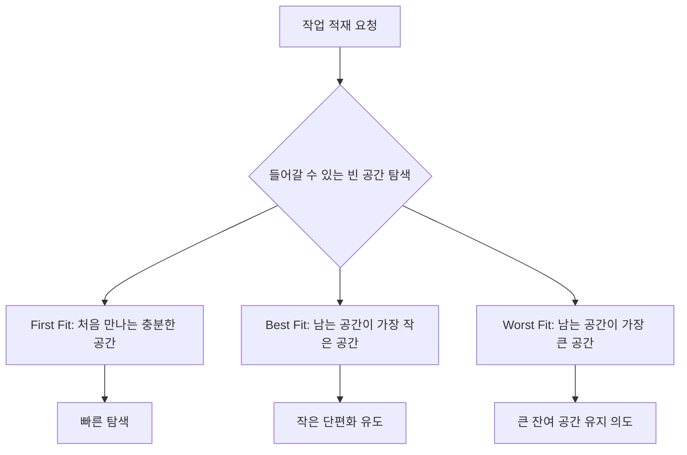

# 200 기억장치의 배치 전략

작성 기준일: 2026-06-01
검색/보강일: 2026-06-01
기준 PDF: `/Users/nes0903/Documents/study/정보처리기사/핵심요약집_2026_정보처리기사필기핵심요약.pdf`
PDF 확인 위치: 30페이지 `200 기억장치의 배치 전략`

## 한 줄 요약

- 기억장치 배치 전략은 새 작업을 어느 빈 공간에 넣을지 결정하는 방식이며, 정보처리기사에서는 최초 적합, 최적 적합, 최악 적합의 선택 기준을 구분한다.

## 한눈에 보는 구조

## PDF 기준 핵심

- 최초 적합(First Fit): 첫 번째 분할 영역에 배치한다.
- 최적 적합(Best Fit): 단편화를 가장 작게 남기는 분할 영역에 배치한다.
- 최악 적합(Worst Fit): 단편화를 가장 많이 남기는 분할 영역에 배치한다.

## 개념 설명

- 연속 메모리 할당에서는 프로세스가 들어갈 수 있는 빈 분할 영역을 찾아야 한다.
- 빈 공간이 여러 개일 때 어떤 공간을 선택하느냐에 따라 외부 단편화와 탐색 시간이 달라진다.
- 외부 단편화는 전체 여유 공간은 충분하지만, 연속된 큰 공간이 없어 할당에 실패하는 현상이다.
- OSTEP의 free-space management 설명처럼 가변 크기 공간에서는 빈 공간이 여러 조각으로 쪼개지는 문제가 핵심이다.

## 시험 포인트

- `First Fit`은 크기 비교를 끝까지 하지 않고, 처음 들어갈 수 있는 곳을 선택한다.
- `Best Fit`은 배치 후 남는 공간이 가장 작은 곳을 찾으므로 모든 후보를 비교하는 식으로 출제되기 쉽다.
- `Worst Fit`은 남는 공간이 가장 큰 곳을 선택한다.
- 문제에서 빈 영역 크기와 작업 크기를 주면 `남는 공간 = 빈 영역 - 작업 크기`를 계산한다.

## 헷갈리는 비교

| 전략 | 선택 기준 | 장점 | 시험 단서 |
|---|---|---|---|
| First Fit | 처음 발견한 충분한 공간 | 탐색이 빠름 | 첫 번째, 처음 만나는 |
| Best Fit | 남는 공간이 최소 | 공간 낭비를 줄이려 함 | 단편화를 가장 작게 |
| Worst Fit | 남는 공간이 최대 | 큰 잔여 공간을 남기려 함 | 단편화를 가장 많이 |

## 예시 또는 암기 포인트

- 빈 공간이 `100, 500, 200, 300`이고 작업 크기가 `212`라면:
- First Fit: 처음으로 충분한 `500`에 배치한다.
- Best Fit: 가능한 후보 `500, 300` 중 남는 공간이 작은 `300`에 배치한다.
- Worst Fit: 가능한 후보 중 가장 큰 `500`에 배치한다.
- 암기식: `최초 = 처음`, `최적 = 남는 게 최소`, `최악 = 남는 게 최대`.

## 빠른 복습

- First Fit은 무엇을 선택하는가? 처음 만나는 충분한 빈 영역.
- Best Fit은 무엇을 최소화하는가? 배치 후 남는 단편화.
- Worst Fit은 어떤 빈 영역을 고르는가? 배치 후 남는 공간이 가장 큰 영역.

## 참고 링크

- [OSTEP - Free-Space Management](https://pages.cs.wisc.edu/~remzi/OSTEP/vm-freespace.pdf)
- [OpenDSA - First Fit Memory Allocation](https://opendsa.cs.vt.edu/ODSA/Books/Everything/html/FirstFit.html)
