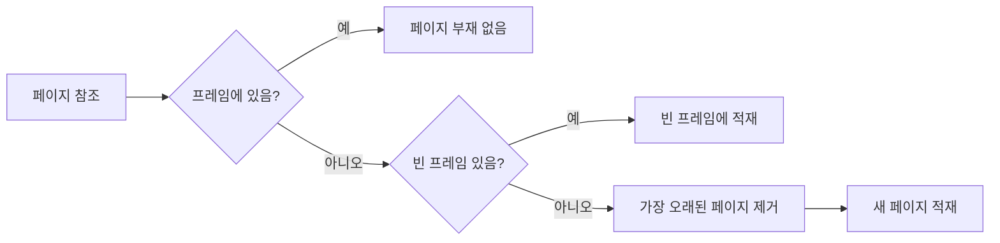

# 201 페이지 교체 알고리즘 - FIFO

작성 기준일: 2026-06-01
검색/보강일: 2026-06-01
기준 PDF: `/Users/nes0903/Documents/study/정보처리기사/핵심요약집_2026_정보처리기사필기핵심요약.pdf`
PDF 확인 위치: 30~31페이지 `201 페이지 교체 알고리즘 - FIFO`

## 한 줄 요약

- FIFO 페이지 교체는 가장 먼저 적재되어 가장 오래 머문 페이지를 먼저 내보내는 방식이다.

## 한눈에 보는 구조

## PDF 기준 핵심

- 각 페이지가 주기억장치에 적재될 때마다 그때의 시간을 기억한다.
- 가장 먼저 들어와서 가장 오래 있었던 페이지를 교체한다.
- PDF 예시는 참조 페이지 `2 3 2 1 5 2 3 5`, 페이지 프레임 3개, 초기 프레임이 비어 있을 때 FIFO 부재 수가 `6`임을 보여 준다.

## 개념 설명

- 가상기억장치에서 필요한 페이지가 주기억장치에 없으면 페이지 부재가 발생한다.
- 프레임이 가득 찬 상태에서 새 페이지를 넣어야 하면 기존 페이지 중 하나를 교체해야 한다.
- FIFO는 페이지의 최근 사용 여부를 보지 않고, 적재 순서만 기준으로 한다.
- 구현은 큐와 비슷하다. 먼저 들어온 페이지가 큐 앞쪽에 있고, 교체 시 그 페이지를 제거한다.

## 시험 포인트

- 이미 프레임에 있는 페이지를 다시 참조하면 부재가 발생하지 않으며, FIFO 순서도 보통 갱신하지 않는다.
- 새 페이지가 들어올 때만 FIFO 큐의 뒤에 추가된다.
- FIFO는 단순하지만, 프레임 수를 늘렸는데도 페이지 부재가 늘어날 수 있는 Belady의 이상 현상이 생길 수 있다.
- 정보처리기사 계산 문제는 표를 직접 그려 부재 발생 칸을 표시하면 실수를 줄일 수 있다.

## 헷갈리는 비교

| 알고리즘 | 교체 기준 | 최근 참조 반영 | 시험 단서 |
|---|---|---|---|
| FIFO | 가장 먼저 적재된 페이지 | 반영하지 않음 | 먼저 들어온 것 |
| LRU | 가장 오래 사용되지 않은 페이지 | 반영함 | 최근 사용 이력 |
| OPT | 앞으로 가장 늦게 사용될 페이지 | 미래 참조열 필요 | 최적, 향후 사용 |

## 예시 또는 암기 포인트

- 참조열 `2 3 2 1 5 2 3 5`, 프레임 3개:
- `2`, `3`, `1`은 빈 프레임에 들어가며 부재가 발생한다.
- `5`가 들어올 때 가장 오래된 `2`가 나간다.
- 다음 `2`가 들어올 때 가장 오래된 `3`이 나간다.
- 다음 `3`이 들어올 때 가장 오래된 `1`이 나간다.
- 총 부재 수는 PDF 기준 `6`이다.

## 빠른 복습

- FIFO의 교체 대상은? 가장 먼저 들어와 가장 오래 있던 페이지.
- 페이지를 다시 참조하면 FIFO 순서가 바뀌는가? 일반적인 FIFO 계산에서는 바뀌지 않는다.
- 계산 문제의 핵심은? 부재 발생 여부와 교체 큐 순서를 분리해서 추적한다.

## 참고 링크

- [OSTEP - Beyond Physical Memory: Policies](https://pages.cs.wisc.edu/~remzi/OSTEP/vm-beyondphys-policy.pdf)

