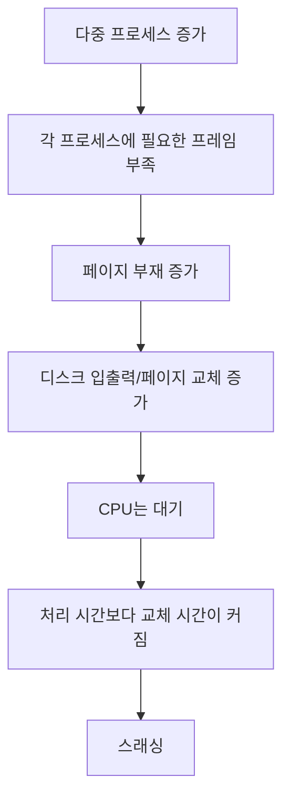

# 202 스래싱(Thrashing)

작성 기준일: 2026-06-01
검색/보강일: 2026-06-01
기준 PDF: `/Users/nes0903/Documents/study/정보처리기사/핵심요약집_2026_정보처리기사필기핵심요약.pdf`
PDF 확인 위치: 31페이지 `202 스래싱(Thrashing)`

## 한 줄 요약

- 스래싱은 프로세스 실행보다 페이지 교체에 시간을 더 많이 써서 시스템 성능이 급격히 떨어지는 현상이다.

## 한눈에 보는 구조

## PDF 기준 핵심

- 프로세스의 처리 시간보다 페이지 교체에 소요되는 시간이 더 많아지는 현상이다.
- 페이지 교체 알고리즘 자체의 문제가 아니라, 필요한 작업 집합을 담을 프레임이 부족할 때 자주 발생한다.

## 개념 설명

- 가상기억장치는 필요한 페이지를 그때그때 주기억장치로 가져온다.
- 그런데 프로세스가 실제로 자주 쓰는 페이지 묶음보다 할당 프레임이 적으면, 방금 내보낸 페이지를 곧 다시 가져와야 한다.
- 이때 CPU는 계산보다 페이지 부재 처리와 디스크 입출력을 기다리는 시간이 길어진다.
- 결과적으로 다중 프로그래밍 정도를 무리하게 높이면 오히려 CPU 이용률과 처리량이 떨어질 수 있다.

## 시험 포인트

- 스래싱의 정의는 PDF 문장 그대로 `처리 시간 < 페이지 교체 시간`으로 외운다.
- 원인 단서: 페이지 부재 빈발, 프레임 부족, 과도한 다중 프로그래밍, 작업 집합 미확보.
- 결과 단서: CPU 이용률 저하, 처리량 감소, 디스크 입출력 증가.
- 해결 단서: 프레임 추가, 다중 프로그래밍 정도 조절, 작업 집합 모델, 페이지 부재 빈도 제어.

## 헷갈리는 비교

| 구분 | 페이지 부재(Page Fault) | 스래싱(Thrashing) |
|---|---|---|
| 의미 | 필요한 페이지가 메모리에 없음 | 페이지 부재가 과도해 실행이 거의 안 됨 |
| 범위 | 개별 사건 | 시스템 성능 저하 상태 |
| 핵심 단서 | 페이지를 가져와야 함 | 교체 시간이 처리 시간보다 큼 |
| 결과 | 한 번의 지연 | 지속적 성능 폭락 |

## 예시 또는 암기 포인트

- 시험에서 `CPU 사용률이 낮아져 더 많은 프로세스를 투입했더니 성능이 더 떨어졌다`는 식이면 스래싱을 의심한다.
- 암기식: `스래싱 = 페이지 교체하느라 일 못 하는 상태`.
- `부재가 많다`는 단서만으로 끝내지 말고, `처리 시간보다 교체 시간이 많다`는 표현을 잡는다.

## 빠른 복습

- 스래싱의 PDF 정의는? 프로세스 처리 시간보다 페이지 교체 시간이 더 많아지는 현상.
- 직접 원인은? 필요한 페이지를 담을 프레임 부족으로 페이지 부재가 반복되는 것.
- 대표 결과는? CPU 이용률과 처리량 저하.

## 참고 링크

- [OSTEP - Beyond Physical Memory: Policies](https://pages.cs.wisc.edu/~remzi/OSTEP/vm-beyondphys-policy.pdf)

